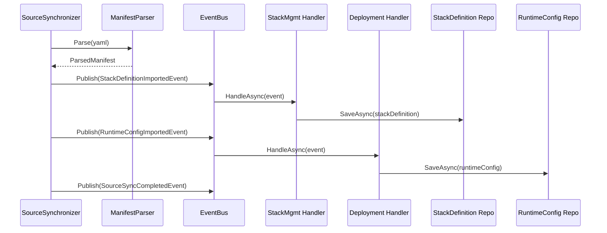

# Bounded Contexts - Domain-Driven Design Architektur

## Inhaltsverzeichnis

1. [Übersicht](#1-übersicht)
2. [Context Map](#2-context-map)
3. [SharedKernel](#3-sharedkernel)
4. [Bounded Context: Catalog](#4-bounded-context-catalog)
5. [Bounded Context: StackManagement](#5-bounded-context-stackmanagement)
6. [Bounded Context: Deployment](#6-bounded-context-deployment)
7. [Bounded Context: IdentityAccess](#7-bounded-context-identityaccess)
8. [Kommunikation zwischen Contexts](#8-kommunikation-zwischen-contexts)
9. [Domain Events](#9-domain-events)
10. [Application Layer als Anti-Corruption Layer](#10-application-layer-als-anti-corruption-layer)
11. [Implementierungsrichtlinien](#11-implementierungsrichtlinien)
12. [Migration vom aktuellen Stand](#12-migration-vom-aktuellen-stand)

---

## 1. Übersicht

ReadyStackGo verwendet Domain-Driven Design (DDD) mit klar definierten Bounded Contexts. Jeder Context hat eine spezifische Verantwortung und eigene Ubiquitous Language.

### Kernprinzipien

- **Strikte Trennung**: Keine Domain-Klasse darf in einem anderen Context direkt verwendet werden
- **Kommunikation nur über IDs**: Contexts referenzieren sich gegenseitig nur über Identifikatoren
- **Events für Datenfluss**: Domain Events transportieren Daten zwischen Contexts
- **Application Layer als Mediator**: Orchestriert die Zusammenarbeit der Contexts

### Die vier Bounded Contexts

| Context | Verantwortung | Kernfrage |
|---------|---------------|-----------|
| **Catalog** | YAML-Import, Quellen-Management, Parsing | "Woher kommen Stacks und wie lese ich sie?" |
| **StackManagement** | Stack-Definitionen, Variablen, Produkte | "Was kann deployed werden?" |
| **Deployment** | Deployments, Runtime-Konfiguration, Container | "Wie läuft der Stack zur Laufzeit?" |
| **IdentityAccess** | Benutzer, Organisationen, Rollen, Berechtigungen | "Wer darf was?" |

### Der SharedKernel

Zusätzlich zu den vier Bounded Contexts gibt es den **SharedKernel** - eine Sammlung von Basis-Klassen und Konzepten, die von **allen** Contexts geteilt werden. Dies ist die einzige erlaubte "Kopplung" zwischen den Contexts.

| Komponente | Beschreibung |
|------------|--------------|
| **Entity<TId>** | Basisklasse für Entitäten mit Identität |
| **AggregateRoot<TId>** | Basisklasse für Aggregate Roots |
| **ValueObject** | Basisklasse für Value Objects |
| **IDomainEvent** | Interface für Domain Events |
| **DomainEvent** | Basisklasse für Domain Events |
| **AssertionConcern** | Validierungs-Hilfsmethoden |
| **SystemClock** | Testbare Zeit-Abstraktion |

---

## 2. Context Map

```
┌─────────────────────────────────────────────────────────────────────────────────┐
│                                                                                 │
│                              CATALOG CONTEXT                                    │
│                                                                                 │
│   Verantwortung: YAML-Import, Quellen-Management, Manifest-Parsing             │
│                                                                                 │
│   ┌─────────────┐  ┌─────────────┐  ┌─────────────┐  ┌─────────────────────┐   │
│   │ StackSource │  │ GitSource   │  │ FileSource  │  │ ManifestParser      │   │
│   │ (Entity)    │  │ (Entity)    │  │ (Entity)    │  │ (Domain Service)    │   │
│   └─────────────┘  └─────────────┘  └─────────────┘  └─────────────────────┘   │
│                                                                                 │
│   ┌─────────────────────────────────────────────────────────────────────────┐   │
│   │ RsgoManifest, RsgoService, RsgoVariable, RsgoMaintenance, etc.          │   │
│   │ (Value Objects - nur für Parsing, nicht für andere Contexts!)           │   │
│   └─────────────────────────────────────────────────────────────────────────┘   │
│                                                                                 │
└─────────────────────────────────────────────────────────────────────────────────┘
                    │                                      │
                    │ StackDefinitionImportedEvent         │ RuntimeConfigImportedEvent
                    ▼                                      ▼
┌───────────────────────────────────────┐    ┌───────────────────────────────────────┐
│                                       │    │                                       │
│       STACKMANAGEMENT CONTEXT         │    │         DEPLOYMENT CONTEXT            │
│                                       │    │                                       │
│   "Was kann deployed werden?"         │    │   "Wie läuft es zur Laufzeit?"        │
│                                       │    │                                       │
│   ┌─────────────────┐                 │    │   ┌─────────────────┐                 │
│   │ StackDefinition │ (Entity)        │    │   │ DeployedStack   │ (Entity)        │
│   │ - StackId       │                 │    │   │ - StackId       │                 │
│   │ - Name          │                 │    │   │ - EnvironmentId │                 │
│   │ - Description   │                 │    │   │ - Status        │                 │
│   │ - Category      │                 │    │   └─────────────────┘                 │
│   │ - Variables     │◄────────────────┼────┼───── (nur StackId!)                   │
│   │ - Services      │                 │    │                                       │
│   └─────────────────┘                 │    │   ┌─────────────────┐                 │
│                                       │    │   │RuntimeStackConfig│ (Entity)       │
│   ┌─────────────────┐                 │    │   │ - StackId       │                 │
│   │ ProductDefinition│ (Entity)       │    │   │ - Maintenance   │                 │
│   │ - ProductId     │                 │    │   │ - HealthCheck   │                 │
│   │ - Name          │                 │    │   │ - Observer      │                 │
│   │ - Stacks[]      │                 │    │   └─────────────────┘                 │
│   └─────────────────┘                 │    │                                       │
│                                       │    │   ┌─────────────────┐                 │
│   ┌─────────────────┐                 │    │   │ Environment     │ (Entity)        │
│   │ VariableDefinition│ (Value Object)│    │   │ - EnvironmentId │                 │
│   │ - Name          │                 │    │   │ - OrganizationId│◄────────────────┼──┐
│   │ - Label         │                 │    │   │ - DockerConfig  │                 │  │
│   │ - Default       │                 │    │   └─────────────────┘                 │  │
│   │ - Validation    │                 │    │                                       │  │
│   └─────────────────┘                 │    │   ┌─────────────────┐                 │  │
│                                       │    │   │ DeploymentPlan  │ (Value Object)  │  │
│   ┌─────────────────┐                 │    │   │ - Services[]    │                 │  │
│   │ ServiceTemplate │ (Value Object)  │    │   │ - Networks[]    │                 │  │
│   │ - Name          │                 │    │   │ - Volumes[]     │                 │  │
│   │ - Image         │                 │    │   └─────────────────┘                 │  │
│   │ - Ports         │                 │    │                                       │  │
│   │ - Environment   │                 │    └───────────────────────────────────────┘  │
│   └─────────────────┘                 │                                               │
│                                       │                                               │
└───────────────────────────────────────┘                                               │
                                                                                        │
┌───────────────────────────────────────────────────────────────────────────────────────┘
│
│    ┌───────────────────────────────────────┐
│    │                                       │
│    │       IDENTITYACCESS CONTEXT          │
│    │                                       │
│    │   "Wer darf was?"                     │
│    │                                       │
│    │   ┌─────────────────┐                 │
│    │   │ User            │ (Entity)        │
│    │   │ - UserId        │                 │
│    │   │ - Username      │                 │
│    │   │ - Roles[]       │                 │
│    │   │ - Organizations │                 │
│    │   └─────────────────┘                 │
│    │                                       │
│    │   ┌─────────────────┐                 │
└────┼──►│ Organization    │ (Entity)        │
     │   │ - OrganizationId│                 │
     │   │ - Name          │                 │
     │   │ - Status        │                 │
     │   │ - Members[]     │                 │
     │   └─────────────────┘                 │
     │                                       │
     │   ┌─────────────────┐                 │
     │   │ Role            │ (Value Object)  │
     │   │ - SystemAdmin   │                 │
     │   │ - OrgOwner      │                 │
     │   │ - Operator      │                 │
     │   │ - Viewer        │                 │
     │   └─────────────────┘                 │
     │                                       │
     └───────────────────────────────────────┘
```

---

## 3. SharedKernel

Der SharedKernel ist eine Sammlung von Basis-Klassen und Konzepten, die von **allen Bounded Contexts gemeinsam genutzt** werden. Er stellt die technische Infrastruktur für Domain-Driven Design bereit und ist die **einzige erlaubte Kopplung** zwischen den Contexts.

### 3.1 Konzept und Zweck

Im Domain-Driven Design ist der SharedKernel ein spezieller Bereich, der:

- **Gemeinsame Abstraktionen** definiert (Entity, ValueObject, AggregateRoot)
- **Technische Basis-Patterns** implementiert, die in allen Domains benötigt werden
- **Von allen Teams gepflegt** wird und bei Änderungen besondere Sorgfalt erfordert
- **Stabil und gut getestet** sein muss, da er fundamentale Auswirkungen hat

```
┌─────────────────────────────────────────────────────────────────────────────┐
│                              SHARED KERNEL                                  │
│                                                                             │
│   Gemeinsame Basis-Klassen für alle Bounded Contexts                        │
│   Namespace: ReadyStackGo.Domain.SharedKernel                               │
│                                                                             │
│   ┌─────────────────────────────────────────────────────────────────────┐   │
│   │                        Tactical Patterns                            │   │
│   │                                                                     │   │
│   │  ┌─────────────┐  ┌─────────────┐  ┌──────────────────┐            │   │
│   │  │ Entity<TId> │  │ ValueObject │  │ AggregateRoot<TId>│            │   │
│   │  │             │  │             │  │                  │            │   │
│   │  │ - Id        │  │ - Equality  │  │ - Version        │            │   │
│   │  │ - Equality  │  │   by Value  │  │ - DomainEvents   │            │   │
│   │  │ - Events    │  │             │  │ - Concurrency    │            │   │
│   │  └─────────────┘  └─────────────┘  └──────────────────┘            │   │
│   │         ▲                                    ▲                      │   │
│   │         │                                    │                      │   │
│   │         └───────────── erbt von ─────────────┘                      │   │
│   └─────────────────────────────────────────────────────────────────────┘   │
│                                                                             │
│   ┌─────────────────────────────────────────────────────────────────────┐   │
│   │                         Domain Events                               │   │
│   │                                                                     │   │
│   │  ┌───────────────┐  ┌─────────────────┐                            │   │
│   │  │ IDomainEvent  │  │ DomainEvent     │                            │   │
│   │  │               │  │                 │                            │   │
│   │  │ - EventVersion│  │ - OccurredOn    │                            │   │
│   │  │ - OccurredOn  │  │ - EventVersion  │                            │   │
│   │  └───────────────┘  └─────────────────┘                            │   │
│   └─────────────────────────────────────────────────────────────────────┘   │
│                                                                             │
│   ┌─────────────────────────────────────────────────────────────────────┐   │
│   │                       Utilities                                     │   │
│   │                                                                     │   │
│   │  ┌──────────────────┐  ┌─────────────────┐                         │   │
│   │  │ AssertionConcern │  │ SystemClock     │                         │   │
│   │  │                  │  │                 │                         │   │
│   │  │ - Validierung    │  │ - UtcNow        │                         │   │
│   │  │ - Preconditions  │  │ - Testable Time │                         │   │
│   │  └──────────────────┘  └─────────────────┘                         │   │
│   └─────────────────────────────────────────────────────────────────────┘   │
│                                                                             │
└─────────────────────────────────────────────────────────────────────────────┘
                    │
    ┌───────────────┼───────────────┬───────────────┬───────────────┐
    │               │               │               │               │
    ▼               ▼               ▼               ▼               ▼
┌────────┐    ┌──────────┐    ┌──────────┐    ┌──────────────┐
│Catalog │    │StackMgmt │    │Deployment│    │IdentityAccess│
└────────┘    └──────────┘    └──────────┘    └──────────────┘
```

### 3.2 Entity<TId>

Die Basisklasse für alle Entitäten mit Identität. Eine Entität wird durch ihre ID identifiziert, nicht durch ihre Attribute.

```csharp
namespace ReadyStackGo.Domain.SharedKernel;

/// <summary>
/// Base class for entities with a typed identity.
/// Based on Vaughn Vernon's IDDD implementation.
/// </summary>
public abstract class Entity<TId> : AssertionConcern
    where TId : notnull
{
    private readonly List<IDomainEvent> _domainEvents = new();

    /// <summary>
    /// Die eindeutige Identität der Entität.
    /// </summary>
    public TId Id { get; protected set; } = default!;

    /// <summary>
    /// Sammlung von Domain Events, die von dieser Entität ausgelöst wurden.
    /// </summary>
    public IReadOnlyCollection<IDomainEvent> DomainEvents => _domainEvents.AsReadOnly();

    /// <summary>
    /// Fügt ein Domain Event zur Sammlung hinzu.
    /// Events werden beim Speichern des Aggregates verarbeitet.
    /// </summary>
    protected void AddDomainEvent(IDomainEvent domainEvent)
    {
        _domainEvents.Add(domainEvent);
    }

    /// <summary>
    /// Löscht alle Domain Events nach der Verarbeitung.
    /// </summary>
    public void ClearDomainEvents()
    {
        _domainEvents.Clear();
    }

    /// <summary>
    /// Gleichheit basiert auf ID, nicht auf Attributen.
    /// Zwei Entitäten mit gleicher ID sind gleich, auch wenn Attribute unterschiedlich sind.
    /// </summary>
    public override bool Equals(object? obj)
    {
        if (obj is not Entity<TId> other) return false;
        if (ReferenceEquals(this, other)) return true;
        if (GetType() != other.GetType()) return false;
        if (Id.Equals(default(TId)) || other.Id.Equals(default(TId))) return false;

        return Id.Equals(other.Id);
    }

    public override int GetHashCode()
    {
        return (GetType().GetHashCode() * 907) + Id.GetHashCode();
    }

    public static bool operator ==(Entity<TId>? left, Entity<TId>? right)
    {
        if (left is null && right is null) return true;
        if (left is null || right is null) return false;
        return left.Equals(right);
    }

    public static bool operator !=(Entity<TId>? left, Entity<TId>? right) => !(left == right);
}

/// <summary>
/// Entity with a Guid-based identity for convenience.
/// </summary>
public abstract class Entity : Entity<Guid>
{
    protected Entity() => Id = Guid.NewGuid();
    protected Entity(Guid id) => Id = id;
}
```

**Verwendungsbeispiel:**

```csharp
// In IdentityAccess Context
public class User : Entity<UserId>
{
    public string Username { get; private set; }
    // ...
}

// In Deployment Context
public class Environment : Entity<EnvironmentId>
{
    public string Name { get; private set; }
    // ...
}
```

### 3.3 AggregateRoot<TId>

Die Basisklasse für Aggregate Roots. Ein Aggregate Root ist der Einstiegspunkt zu einem Aggregat und garantiert die Konsistenz innerhalb der Aggregatgrenze.

```csharp
namespace ReadyStackGo.Domain.SharedKernel;

/// <summary>
/// Base class for aggregate roots with a typed identity.
/// An aggregate root is the entry point to an aggregate and ensures
/// transactional consistency within the aggregate boundary.
/// Based on Vaughn Vernon's IDDD implementation.
/// </summary>
public abstract class AggregateRoot<TId> : Entity<TId>
    where TId : notnull
{
    /// <summary>
    /// Version for optimistic concurrency control.
    /// Wird bei jeder Änderung inkrementiert.
    /// </summary>
    public int Version { get; protected set; }

    /// <summary>
    /// Erhöht die Version bei Änderungen.
    /// Ermöglicht Erkennung von Concurrent Updates.
    /// </summary>
    protected void IncrementVersion()
    {
        Version++;
    }
}

/// <summary>
/// Aggregate root with a Guid-based identity.
/// </summary>
public abstract class AggregateRoot : AggregateRoot<Guid>
{
    protected AggregateRoot() => Id = Guid.NewGuid();
    protected AggregateRoot(Guid id) => Id = id;
}
```

**Verwendungsbeispiel:**

```csharp
// In StackManagement Context
public class StackDefinition : AggregateRoot<StackId>
{
    public string Name { get; private set; }
    public IReadOnlyList<VariableDefinition> Variables { get; private set; }

    public void UpdateVariables(IEnumerable<VariableDefinition> variables)
    {
        Variables = variables.ToList();
        IncrementVersion();
        AddDomainEvent(new StackVariablesUpdatedEvent(Id, Variables));
    }
}
```

### 3.4 ValueObject

Die Basisklasse für Value Objects. Value Objects haben keine Identität und werden durch ihre Attribute definiert. Zwei Value Objects mit gleichen Attributen sind gleich.

```csharp
namespace ReadyStackGo.Domain.SharedKernel;

/// <summary>
/// Base class for value objects implementing equality by value.
/// Value Objects are immutable and compared by their attributes.
/// Based on Vaughn Vernon's IDDD implementation.
/// </summary>
public abstract class ValueObject : AssertionConcern
{
    /// <summary>
    /// Returns all components that constitute the identity of this value object.
    /// Override to include all properties that define equality.
    /// </summary>
    protected abstract IEnumerable<object?> GetEqualityComponents();

    public override bool Equals(object? obj)
    {
        if (ReferenceEquals(this, obj)) return true;
        if (obj is null) return false;
        if (GetType() != obj.GetType()) return false;

        var other = (ValueObject)obj;
        return GetEqualityComponents().SequenceEqual(other.GetEqualityComponents());
    }

    public override int GetHashCode()
    {
        return GetEqualityComponents()
            .Aggregate(17, (current, component) =>
                current * 23 + (component?.GetHashCode() ?? 0));
    }

    public static bool operator ==(ValueObject? left, ValueObject? right)
    {
        if (left is null && right is null) return true;
        if (left is null || right is null) return false;
        return left.Equals(right);
    }

    public static bool operator !=(ValueObject? left, ValueObject? right) => !(left == right);
}
```

**Verwendungsbeispiel:**

```csharp
// In IdentityAccess Context
public class Email : ValueObject
{
    public string Value { get; }

    public Email(string value)
    {
        SelfAssertArgumentNotEmpty(value, "Email cannot be empty");
        SelfAssertArgumentMatches(@"^.+@.+\..+$", value, "Invalid email format");
        Value = value.ToLowerInvariant();
    }

    protected override IEnumerable<object?> GetEqualityComponents()
    {
        yield return Value;
    }
}

// In StackManagement Context
public class VariableDefinition : ValueObject
{
    public string Name { get; }
    public string? Label { get; }
    public string? DefaultValue { get; }
    public bool IsRequired { get; }

    protected override IEnumerable<object?> GetEqualityComponents()
    {
        yield return Name;
        yield return Label;
        yield return DefaultValue;
        yield return IsRequired;
    }
}
```

### 3.5 IDomainEvent und DomainEvent

Die Infrastruktur für Domain Events. Events werden von Entitäten ausgelöst und ermöglichen lose Kopplung zwischen Aggregaten und Bounded Contexts.

```csharp
namespace ReadyStackGo.Domain.SharedKernel;

/// <summary>
/// Marker interface for domain events.
/// Domain Events represent something that happened in the domain.
/// </summary>
public interface IDomainEvent
{
    /// <summary>
    /// Version des Event-Schemas für Versionierung.
    /// </summary>
    int EventVersion { get; }

    /// <summary>
    /// Zeitpunkt, zu dem das Event aufgetreten ist.
    /// </summary>
    DateTime OccurredOn { get; }
}

/// <summary>
/// Base class for domain events.
/// Provides default implementation for common properties.
/// </summary>
public abstract class DomainEvent : IDomainEvent
{
    protected DomainEvent()
    {
        EventVersion = 1;
        OccurredOn = SystemClock.UtcNow;
    }

    public int EventVersion { get; protected set; }
    public DateTime OccurredOn { get; protected set; }
}
```

**Verwendungsbeispiel:**

```csharp
// In Catalog Context
public class StackDefinitionImportedEvent : DomainEvent
{
    public string StackId { get; }
    public string SourceId { get; }
    public string Name { get; }

    public StackDefinitionImportedEvent(string stackId, string sourceId, string name)
    {
        StackId = stackId;
        SourceId = sourceId;
        Name = name;
    }
}

// In Deployment Context
public class DeploymentCompletedEvent : DomainEvent
{
    public string DeploymentId { get; }
    public bool Success { get; }
    public int ServicesDeployed { get; }

    public DeploymentCompletedEvent(string deploymentId, bool success, int servicesDeployed)
    {
        DeploymentId = deploymentId;
        Success = success;
        ServicesDeployed = servicesDeployed;
    }
}
```

### 3.6 AssertionConcern

Eine Hilfsklasse für Validierungen und Preconditions in Domain-Objekten. Ermöglicht deklarative Validierung in Konstruktoren und Methoden.

```csharp
namespace ReadyStackGo.Domain.SharedKernel;

/// <summary>
/// Base class providing assertion methods for domain validation.
/// Provides both static methods and instance methods (Self-prefixed).
/// Based on Vaughn Vernon's IDDD implementation.
/// </summary>
public class AssertionConcern
{
    // === Statische Methoden für externe Nutzung ===

    public static void AssertArgumentNotNull(object? value, string message)
    {
        if (value == null)
            throw new ArgumentNullException(message);
    }

    public static void AssertArgumentNotEmpty(string? value, string message)
    {
        if (string.IsNullOrWhiteSpace(value))
            throw new ArgumentException(message);
    }

    public static void AssertArgumentLength(string value, int min, int max, string message)
    {
        int length = value.Trim().Length;
        if (length < min || length > max)
            throw new ArgumentException(message);
    }

    public static void AssertArgumentMatches(string pattern, string value, string message)
    {
        var regex = new Regex(pattern);
        if (!regex.IsMatch(value))
            throw new ArgumentException(message);
    }

    public static void AssertArgumentRange(int value, int min, int max, string message)
    {
        if (value < min || value > max)
            throw new ArgumentOutOfRangeException(message);
    }

    public static void AssertArgumentTrue(bool condition, string message)
    {
        if (!condition)
            throw new ArgumentException(message);
    }

    public static void AssertStateFalse(bool condition, string message)
    {
        if (condition)
            throw new InvalidOperationException(message);
    }

    public static void AssertStateTrue(bool condition, string message)
    {
        if (!condition)
            throw new InvalidOperationException(message);
    }

    // === Instanz-Methoden für Verwendung in Domain-Objekten ===

    protected void SelfAssertArgumentNotNull(object? value, string message)
        => AssertArgumentNotNull(value, message);

    protected void SelfAssertArgumentNotEmpty(string? value, string message)
        => AssertArgumentNotEmpty(value, message);

    protected void SelfAssertArgumentLength(string value, int min, int max, string message)
        => AssertArgumentLength(value, min, max, message);

    protected void SelfAssertArgumentMatches(string pattern, string value, string message)
        => AssertArgumentMatches(pattern, value, message);

    // ... weitere Self-Methoden
}
```

**Verwendungsbeispiel:**

```csharp
// In IdentityAccess Context
public class Organization : AggregateRoot<OrganizationId>
{
    public string Name { get; private set; }

    public Organization(OrganizationId id, string name)
    {
        SelfAssertArgumentNotNull(id, "Organization ID cannot be null");
        SelfAssertArgumentNotEmpty(name, "Organization name cannot be empty");
        SelfAssertArgumentLength(name, 2, 100, "Organization name must be 2-100 characters");

        Id = id;
        Name = name;
    }

    public void Rename(string newName)
    {
        SelfAssertArgumentNotEmpty(newName, "New name cannot be empty");
        SelfAssertStateTrue(IsActive, "Cannot rename inactive organization");

        Name = newName;
        IncrementVersion();
    }
}
```

### 3.7 SystemClock

Eine testbare Abstraktion für die Systemzeit. Ermöglicht deterministische Tests ohne Abhängigkeit von der echten Systemzeit.

```csharp
namespace ReadyStackGo.Domain.SharedKernel;

/// <summary>
/// Provides a testable abstraction for system time.
/// Based on the .NET 8+ TimeProvider pattern.
///
/// Production usage: SystemClock.UtcNow
/// Test usage: SystemClock.SetProvider(fakeTimeProvider)
/// </summary>
public static class SystemClock
{
    private static TimeProvider _provider = TimeProvider.System;

    /// <summary>
    /// Gets the current UTC time.
    /// </summary>
    public static DateTime UtcNow => _provider.GetUtcNow().UtcDateTime;

    /// <summary>
    /// Gets the current UTC time as DateTimeOffset.
    /// </summary>
    public static DateTimeOffset UtcNowOffset => _provider.GetUtcNow();

    /// <summary>
    /// Sets the time provider for testing.
    /// Use FakeTimeProvider from Microsoft.Extensions.TimeProvider.Testing.
    /// </summary>
    public static void SetProvider(TimeProvider provider)
    {
        _provider = provider ?? TimeProvider.System;
    }

    /// <summary>
    /// Resets to the default system time provider.
    /// Call in test cleanup to avoid test pollution.
    /// </summary>
    public static void Reset()
    {
        _provider = TimeProvider.System;
    }

    /// <summary>
    /// Gets the underlying TimeProvider for advanced scenarios.
    /// </summary>
    public static TimeProvider Provider => _provider;
}
```

**Verwendungsbeispiel:**

```csharp
// In Domain Code
public class Deployment : AggregateRoot<DeploymentId>
{
    public DateTime CreatedAt { get; private set; }
    public DateTime? CompletedAt { get; private set; }

    public Deployment(DeploymentId id)
    {
        Id = id;
        CreatedAt = SystemClock.UtcNow;  // Verwendet SystemClock
    }

    public void Complete()
    {
        CompletedAt = SystemClock.UtcNow;  // Testbar!
    }
}

// In Unit Tests
[Fact]
public void Complete_SetsCompletedAt()
{
    // Arrange
    var fakeTime = new FakeTimeProvider(new DateTime(2024, 1, 15, 10, 30, 0, DateTimeKind.Utc));
    SystemClock.SetProvider(fakeTime);

    var deployment = new Deployment(new DeploymentId(Guid.NewGuid()));

    // Act
    fakeTime.Advance(TimeSpan.FromMinutes(5));
    deployment.Complete();

    // Assert
    Assert.Equal(new DateTime(2024, 1, 15, 10, 35, 0), deployment.CompletedAt);

    // Cleanup
    SystemClock.Reset();
}
```

### 3.8 Regeln für den SharedKernel

#### Was gehört in den SharedKernel?

- **Technische Basis-Patterns** (Entity, ValueObject, AggregateRoot)
- **Cross-Cutting Concerns** (SystemClock, Validierung)
- **Event-Infrastruktur** (IDomainEvent, DomainEvent)
- **Gemeinsame Exceptions** (DomainException, etc.)

#### Was gehört NICHT in den SharedKernel?

- **Fachliche Konzepte** (User, Stack, Environment)
- **Context-spezifische Value Objects** (Email gehört zu IdentityAccess)
- **Business Rules** (diese gehören in die jeweiligen Contexts)
- **DTOs oder API-Objekte** (diese gehören in Application/API Layer)

#### Änderungsregeln

1. **Änderungen am SharedKernel erfordern besondere Sorgfalt**
2. **Alle Teams müssen bei Änderungen informiert werden**
3. **Änderungen müssen abwärtskompatibel sein** (wenn möglich)
4. **Umfangreiche Testabdeckung ist Pflicht**
5. **Code Reviews durch mehrere Entwickler**

### 3.9 Verzeichnisstruktur

```
ReadyStackGo.Domain/
└── SharedKernel/
    ├── AggregateRoot.cs          # Basis für Aggregate Roots
    ├── AssertionConcern.cs       # Validierungs-Utilities
    ├── DomainEvent.cs            # Basis für Domain Events
    ├── Entity.cs                 # Basis für Entitäten
    ├── IDomainEvent.cs           # Interface für Domain Events
    ├── SystemClock.cs            # Testbare Zeit-Abstraktion
    └── ValueObject.cs            # Basis für Value Objects
```

---

## 4. Bounded Context: Catalog

### 4.1 Verantwortung

Der Catalog Context ist verantwortlich für:

- **Quellen-Management**: Konfiguration und Verwaltung von Stack-Quellen (Git, Dateisystem, URL)
- **Synchronisation**: Abrufen von Manifesten aus den konfigurierten Quellen
- **YAML-Parsing**: Umwandlung von YAML-Manifesten in strukturierte Daten
- **Event-Publishing**: Benachrichtigung anderer Contexts über importierte Daten

### 3.2 Ubiquitous Language

| Begriff | Bedeutung |
|---------|-----------|
| **StackSource** | Eine konfigurierte Quelle für Stack-Manifeste |
| **Manifest** | Die YAML-Datei, die einen Stack beschreibt |
| **Sync** | Der Prozess des Abrufens und Parsens von Manifesten |
| **ImportResult** | Das Ergebnis eines Import-Vorgangs |

### 3.3 Entitäten und Value Objects

```csharp
// Entities
public class StackSource : Entity<StackSourceId>
{
    public string Name { get; }
    public SourceType Type { get; }           // Git, File, Url
    public string Location { get; }           // URL, Pfad, etc.
    public bool IsEnabled { get; }
    public DateTime? LastSyncAt { get; }
    public SyncStatus LastSyncStatus { get; }
}

public class GitSource : StackSource
{
    public string Branch { get; }
    public string? SubPath { get; }
    public GitCredentials? Credentials { get; }
}

public class FileSource : StackSource
{
    public string BasePath { get; }
    public string FilePattern { get; }        // z.B. "*.rsgo.yaml"
}

// Value Objects - NUR für Parsing, werden nicht persistiert!
public record RsgoManifest { ... }            // Parsed YAML structure
public record RsgoService { ... }
public record RsgoVariable { ... }
public record RsgoMaintenance { ... }
public record RsgoHealthCheck { ... }
public record RsgoObserver { ... }
```

### 3.4 Domain Services

```csharp
public interface IManifestParser
{
    /// <summary>
    /// Parst ein YAML-Manifest und gibt die strukturierten Daten zurück.
    /// </summary>
    ParsedManifest Parse(string yaml, StackSourceId sourceId);
}

public interface ISourceSynchronizer
{
    /// <summary>
    /// Synchronisiert eine einzelne Quelle.
    /// </summary>
    Task<SyncResult> SyncAsync(StackSource source, CancellationToken ct);

    /// <summary>
    /// Synchronisiert alle aktivierten Quellen.
    /// </summary>
    Task<IEnumerable<SyncResult>> SyncAllAsync(CancellationToken ct);
}
```

### 3.5 Output: Domain Events

Der Catalog Context feuert Events, die von anderen Contexts konsumiert werden:

```csharp
/// <summary>
/// Gefeuert wenn ein Stack-Manifest erfolgreich importiert wurde.
/// Enthält die Daten für den StackManagement Context.
/// </summary>
public record StackDefinitionImportedEvent(
    string StackId,
    string SourceId,
    string Name,
    string? Description,
    string? Category,
    string ProductVersion,
    IReadOnlyList<ImportedVariable> Variables,
    IReadOnlyList<ImportedService> Services,
    ImportedProductInfo? Product
) : IDomainEvent;

/// <summary>
/// Gefeuert wenn Runtime-Konfiguration importiert wurde.
/// Enthält die Daten für den Deployment Context.
/// </summary>
public record RuntimeConfigImportedEvent(
    string StackId,
    string SourceId,
    ImportedMaintenanceConfig? Maintenance,
    ImportedHealthCheckConfig? HealthCheck,
    IReadOnlyList<ImportedObserverConfig> Observers
) : IDomainEvent;

/// <summary>
/// Gefeuert wenn eine Quelle erfolgreich synchronisiert wurde.
/// </summary>
public record SourceSyncCompletedEvent(
    string SourceId,
    int StacksImported,
    int StacksUpdated,
    int StacksRemoved,
    DateTime SyncedAt
) : IDomainEvent;
```

### 3.6 Was der Catalog Context NICHT macht

- **Keine Persistierung** von Stack-Definitionen (das macht StackManagement)
- **Keine Persistierung** von Runtime-Configs (das macht Deployment)
- **Keine Validierung** von Deployment-Voraussetzungen
- **Keine Kenntnis** von Environments oder Benutzern

---

## 4. Bounded Context: StackManagement

### 4.1 Verantwortung

Der StackManagement Context ist verantwortlich für:

- **Stack-Katalog**: Verwaltung aller verfügbaren Stack-Definitionen
- **Produkt-Gruppierung**: Organisation von Stacks in Produkte
- **Variablen-Schema**: Definition der konfigurierbaren Parameter
- **Service-Templates**: Abstrakte Definition der Container (ohne Runtime-Details)

### 4.2 Ubiquitous Language

| Begriff | Bedeutung |
|---------|-----------|
| **StackDefinition** | Die Beschreibung eines deployb are Stacks |
| **Product** | Eine logische Gruppierung verwandter Stacks |
| **Variable** | Ein konfigurierbarer Parameter mit Validierungsregeln |
| **ServiceTemplate** | Die abstrakte Definition eines Containers |
| **Category** | Kategorisierung für UI-Gruppierung |

### 4.3 Entitäten und Value Objects

```csharp
// Entity - Aggregate Root
public class StackDefinition : AggregateRoot<StackId>
{
    public string Name { get; }
    public string? Description { get; }
    public string? Category { get; }
    public string ProductVersion { get; }
    public StackSourceId SourceId { get; }

    // Value Object Collections
    public IReadOnlyList<VariableDefinition> Variables { get; }
    public IReadOnlyList<ServiceTemplate> Services { get; }

    // Computed Properties
    public bool HasRequiredVariables => Variables.Any(v => v.IsRequired);
    public IEnumerable<string> ServiceNames => Services.Select(s => s.Name);
}

// Entity
public class ProductDefinition : Entity<ProductId>
{
    public string Name { get; }
    public string? Description { get; }
    public string? LogoUrl { get; }
    public IReadOnlyList<StackId> StackIds { get; }
}

// Value Objects
public record VariableDefinition
{
    public required string Name { get; init; }
    public string? Label { get; init; }
    public string? Description { get; init; }
    public string? DefaultValue { get; init; }
    public bool IsRequired { get; init; }
    public VariableType Type { get; init; }
    public IReadOnlyList<ValidationRule> ValidationRules { get; init; }
}

public record ServiceTemplate
{
    public required string Name { get; init; }
    public required string Image { get; init; }
    public IReadOnlyList<PortMapping> Ports { get; init; }
    public IReadOnlyList<VolumeMapping> Volumes { get; init; }
    public IReadOnlyList<string> DependsOn { get; init; }
    public IReadOnlyDictionary<string, string> Environment { get; init; }
    public IReadOnlyDictionary<string, string> Labels { get; init; }
}

public record ValidationRule
{
    public ValidationType Type { get; init; }      // Regex, MinLength, MaxLength, etc.
    public string? Pattern { get; init; }
    public string? ErrorMessage { get; init; }
}
```

### 4.4 Repositories

```csharp
public interface IStackDefinitionRepository
{
    Task<StackDefinition?> GetByIdAsync(StackId id, CancellationToken ct);
    Task<IEnumerable<StackDefinition>> GetAllAsync(CancellationToken ct);
    Task<IEnumerable<StackDefinition>> GetBySourceAsync(StackSourceId sourceId, CancellationToken ct);
    Task<IEnumerable<StackDefinition>> GetByCategoryAsync(string category, CancellationToken ct);
    Task SaveAsync(StackDefinition stack, CancellationToken ct);
    Task DeleteAsync(StackId id, CancellationToken ct);
}

public interface IProductRepository
{
    Task<ProductDefinition?> GetByIdAsync(ProductId id, CancellationToken ct);
    Task<IEnumerable<ProductDefinition>> GetAllAsync(CancellationToken ct);
    Task SaveAsync(ProductDefinition product, CancellationToken ct);
}
```

### 4.5 Event Handler

```csharp
/// <summary>
/// Verarbeitet importierte Stack-Definitionen vom Catalog Context.
/// </summary>
public class StackDefinitionImportedEventHandler : IEventHandler<StackDefinitionImportedEvent>
{
    private readonly IStackDefinitionRepository _repository;

    public async Task HandleAsync(StackDefinitionImportedEvent @event, CancellationToken ct)
    {
        var stackDefinition = MapToEntity(@event);
        await _repository.SaveAsync(stackDefinition, ct);
    }

    private StackDefinition MapToEntity(StackDefinitionImportedEvent @event)
    {
        // Mapping von Event-Daten zu Domain Entity
        return new StackDefinition(
            id: new StackId(@event.StackId),
            name: @event.Name,
            description: @event.Description,
            category: @event.Category,
            productVersion: @event.ProductVersion,
            sourceId: new StackSourceId(@event.SourceId),
            variables: @event.Variables.Select(MapVariable).ToList(),
            services: @event.Services.Select(MapService).ToList()
        );
    }
}
```

### 4.6 Was StackManagement NICHT enthält

- **Kein YAML-Parsing** (das macht Catalog)
- **Keine Maintenance-Konfiguration** (das macht Deployment)
- **Keine HealthCheck-Konfiguration** (das macht Deployment)
- **Keine Observer-Konfiguration** (das macht Deployment)
- **Keine Runtime-Informationen** (das macht Deployment)
- **Keine Benutzer/Organisationen** (das macht IdentityAccess)

---

## 5. Bounded Context: Deployment

### 5.1 Verantwortung

Der Deployment Context ist verantwortlich für:

- **Environments**: Verwaltung von Deployment-Zielen (Docker-Hosts)
- **Deployments**: Ausführung und Tracking von Stack-Deployments
- **Runtime-Konfiguration**: Maintenance, HealthChecks, Observer
- **Container-Management**: Lifecycle deployed Container
- **DeployedStack**: Persistierung des Deployment-Zustands

### 5.2 Ubiquitous Language

| Begriff | Bedeutung |
|---------|-----------|
| **Environment** | Ein Deployment-Ziel (Docker-Host) |
| **DeployedStack** | Ein aktuell laufender Stack |
| **DeploymentPlan** | Der Plan für ein Deployment (Services, Netzwerke, Volumes) |
| **RuntimeStackConfig** | Laufzeit-Konfiguration (Maintenance, Health, Observer) |
| **MaintenanceWindow** | Geplante Wartungsfenster |
| **HealthCheck** | Konfiguration für Gesundheitsprüfungen |
| **Observer** | Externe Benachrichtigungsziele |

### 5.3 Entitäten und Value Objects

```csharp
// Entity - Aggregate Root
public class Environment : AggregateRoot<EnvironmentId>
{
    public string Name { get; }
    public OrganizationId OrganizationId { get; }     // Referenz auf IdentityAccess
    public EnvironmentType Type { get; }               // DockerSocket, DockerApi
    public DockerConnectionConfig Connection { get; }
    public bool IsDefault { get; }
}

// Entity - Aggregate Root
public class DeployedStack : AggregateRoot<DeployedStackId>
{
    public StackId StackId { get; }                   // Referenz auf StackManagement
    public EnvironmentId EnvironmentId { get; }
    public string StackName { get; }                  // Instanz-Name
    public DeploymentStatus Status { get; }
    public DateTime DeployedAt { get; }
    public string? DeployedBy { get; }                // UserId als String

    public IReadOnlyList<DeployedService> Services { get; }
    public IReadOnlyDictionary<string, string> ResolvedVariables { get; }
}

// Entity
public class RuntimeStackConfig : Entity<RuntimeStackConfigId>
{
    public StackId StackId { get; }                   // Gleiche ID wie in StackManagement!
    public MaintenanceConfig? Maintenance { get; }
    public HealthCheckConfig? HealthCheck { get; }
    public IReadOnlyList<ObserverConfig> Observers { get; }
}

// Value Objects
public record MaintenanceConfig
{
    public string? Schedule { get; init; }            // Cron-Expression
    public TimeSpan? Duration { get; init; }
    public bool NotifyBefore { get; init; }
    public TimeSpan? NotifyBeforeDuration { get; init; }
    public IReadOnlyList<string> AffectedServices { get; init; }
}

public record HealthCheckConfig
{
    public string Endpoint { get; init; }
    public TimeSpan Interval { get; init; }
    public TimeSpan Timeout { get; init; }
    public int UnhealthyThreshold { get; init; }
    public int HealthyThreshold { get; init; }
    public IReadOnlyList<int> ExpectedStatusCodes { get; init; }
}

public record ObserverConfig
{
    public string Name { get; init; }
    public ObserverType Type { get; init; }           // Webhook, Email, Slack, etc.
    public string Target { get; init; }               // URL, Email-Adresse, etc.
    public IReadOnlyList<ObserverEvent> Events { get; init; }
}

public record DeploymentPlan
{
    public required StackId StackId { get; init; }
    public required string StackName { get; init; }
    public required EnvironmentId EnvironmentId { get; init; }

    public IReadOnlyList<PlannedService> Services { get; init; }
    public IReadOnlyList<PlannedNetwork> Networks { get; init; }
    public IReadOnlyList<PlannedVolume> Volumes { get; init; }
    public IReadOnlyDictionary<string, string> ResolvedVariables { get; init; }
}

public record PlannedService
{
    public required string Name { get; init; }
    public required string Image { get; init; }
    public IReadOnlyList<ResolvedPortMapping> Ports { get; init; }
    public IReadOnlyList<ResolvedVolumeMapping> Volumes { get; init; }
    public IReadOnlyDictionary<string, string> Environment { get; init; }
    public IReadOnlyDictionary<string, string> Labels { get; init; }
    public IReadOnlyList<string> Networks { get; init; }
    public IReadOnlyList<string> DependsOn { get; init; }
    public ServiceHealthCheck? HealthCheck { get; init; }
}
```

### 5.4 Domain Services

```csharp
public interface IDeploymentPlanFactory
{
    /// <summary>
    /// Erstellt einen DeploymentPlan aus StackManagement-Daten und User-Variablen.
    /// Dies ist die Schnittstelle zum Application Layer, der die Daten zusammenführt.
    /// </summary>
    DeploymentPlan CreatePlan(
        StackId stackId,
        string stackName,
        EnvironmentId environmentId,
        IReadOnlyList<PlannedService> services,
        IReadOnlyDictionary<string, string> resolvedVariables);
}

public interface IDeploymentExecutor
{
    /// <summary>
    /// Führt einen DeploymentPlan aus.
    /// </summary>
    Task<DeploymentResult> ExecuteAsync(
        DeploymentPlan plan,
        IProgress<DeploymentProgress>? progress,
        CancellationToken ct);
}

public class DeploymentPrerequisiteValidator
{
    /// <summary>
    /// Validiert Deployment-Voraussetzungen (Environment, Organisation, User).
    /// Erhält Stack-Informationen als StackValidationInfo Value Object.
    /// </summary>
    public DeploymentPrerequisiteResult Validate(
        EnvironmentId environmentId,
        StackValidationInfo stackInfo,      // Value Object - NICHT StackDefinition!
        IDictionary<string, string> providedVariables,
        User user);                          // User aus IdentityAccess (via Application Layer)
}
```

### 5.5 Event Handler

```csharp
/// <summary>
/// Verarbeitet importierte Runtime-Konfiguration vom Catalog Context.
/// </summary>
public class RuntimeConfigImportedEventHandler : IEventHandler<RuntimeConfigImportedEvent>
{
    private readonly IRuntimeStackConfigRepository _repository;

    public async Task HandleAsync(RuntimeConfigImportedEvent @event, CancellationToken ct)
    {
        var config = new RuntimeStackConfig(
            stackId: new StackId(@event.StackId),
            maintenance: MapMaintenance(@event.Maintenance),
            healthCheck: MapHealthCheck(@event.HealthCheck),
            observers: @event.Observers.Select(MapObserver).ToList()
        );

        await _repository.SaveAsync(config, ct);
    }
}
```

### 5.6 Was Deployment NICHT enthält

- **Kein YAML-Parsing** (das macht Catalog)
- **Keine Stack-Definitionen** (das macht StackManagement)
- **Keine Variablen-Schemata** (das macht StackManagement)
- **Keine Benutzer-Verwaltung** (das macht IdentityAccess)

---

## 6. Bounded Context: IdentityAccess

### 6.1 Verantwortung

Der IdentityAccess Context ist verantwortlich für:

- **Benutzerverwaltung**: Erstellung, Aktivierung, Deaktivierung von Benutzern
- **Authentifizierung**: Login, Token-Verwaltung, Passwort-Hashing
- **Organisationen**: Multi-Tenant-Unterstützung
- **Rollen und Berechtigungen**: RBAC (Role-Based Access Control)
- **Mitgliedschaften**: Zuordnung von Benutzern zu Organisationen

### 6.2 Ubiquitous Language

| Begriff | Bedeutung |
|---------|-----------|
| **User** | Ein Benutzer des Systems |
| **Organization** | Ein Mandant/Tenant |
| **Role** | Eine Rolle mit Berechtigungen |
| **Membership** | Die Zugehörigkeit eines Users zu einer Organization |
| **SystemAdmin** | Globaler Administrator |
| **OrgOwner** | Eigentümer einer Organisation |

### 6.3 Entitäten und Value Objects

```csharp
// Entity - Aggregate Root
public class User : AggregateRoot<UserId>
{
    public string Username { get; }
    public Email Email { get; }
    public PasswordHash PasswordHash { get; }
    public bool IsActive { get; }
    public bool IsSystemAdmin { get; }
    public DateTime CreatedAt { get; }
    public DateTime? LastLoginAt { get; }

    public IReadOnlyList<OrganizationMembership> Memberships { get; }

    // Domain Logic
    public bool IsMemberOfOrganization(string organizationId);
    public bool HasRoleInOrganization(OrganizationId orgId, Role role);
    public bool CanAccessEnvironment(EnvironmentId envId);
}

// Entity - Aggregate Root
public class Organization : AggregateRoot<OrganizationId>
{
    public string Name { get; }
    public string? Description { get; }
    public OrganizationStatus Status { get; }         // Active, Inactive, Suspended
    public DateTime CreatedAt { get; }

    public IReadOnlyList<UserId> MemberIds { get; }
    public UserId OwnerId { get; }

    // Domain Logic
    public bool IsActive => Status == OrganizationStatus.Active;
    public bool HasMember(UserId userId);
}

// Value Objects
public record OrganizationMembership
{
    public OrganizationId OrganizationId { get; init; }
    public Role Role { get; init; }
    public DateTime JoinedAt { get; init; }
}

public record Email
{
    public string Value { get; }

    public Email(string value)
    {
        if (!IsValidEmail(value))
            throw new InvalidEmailException(value);
        Value = value;
    }
}

public record PasswordHash
{
    public string Hash { get; }
    public string Salt { get; }
}

public enum Role
{
    Viewer = 0,
    Operator = 1,
    OrgOwner = 2
}

public enum OrganizationStatus
{
    Active = 0,
    Inactive = 1,
    Suspended = 2
}
```

### 6.4 Domain Services

```csharp
public interface IPasswordHasher
{
    PasswordHash Hash(string plainPassword);
    bool Verify(string plainPassword, PasswordHash hash);
}

public interface IAuthenticationService
{
    Task<AuthResult> AuthenticateAsync(string username, string password, CancellationToken ct);
    Task<RefreshResult> RefreshTokenAsync(string refreshToken, CancellationToken ct);
}

public interface IAuthorizationService
{
    bool CanUserAccessOrganization(User user, OrganizationId organizationId);
    bool CanUserDeployToEnvironment(User user, EnvironmentId environmentId);
    bool CanUserManageUsers(User user, OrganizationId organizationId);
}
```

### 6.5 Was IdentityAccess NICHT enthält

- **Keine Stack-Informationen** (das macht StackManagement)
- **Keine Deployment-Logik** (das macht Deployment)
- **Keine Environment-Verwaltung** (das macht Deployment)
- **Kein YAML-Parsing** (das macht Catalog)

---

## 7. Kommunikation zwischen Contexts

### 7.1 Grundregeln

1. **Keine direkten Referenzen**: Ein Context verwendet niemals Domain-Klassen eines anderen Contexts
2. **Nur IDs**: Referenzen zwischen Contexts erfolgen ausschließlich über String-IDs oder typisierte ID-Value-Objects
3. **Application Layer orchestriert**: Der Application Layer holt Daten aus verschiedenen Contexts und führt sie zusammen
4. **Events für Datenfluss**: Asynchrone Kommunikation erfolgt über Domain Events

### 7.2 Erlaubte Referenzen

```
┌─────────────────────────────────────────────────────────────────────────────┐
│                           ERLAUBTE REFERENZEN                               │
├─────────────────────────────────────────────────────────────────────────────┤
│                                                                             │
│  Deployment.Environment      ──────► OrganizationId (string/ValueObject)    │
│                              NICHT► Organization (Entity)                   │
│                                                                             │
│  Deployment.DeployedStack    ──────► StackId (string/ValueObject)           │
│                              NICHT► StackDefinition (Entity)                │
│                                                                             │
│  Deployment.DeployedStack    ──────► UserId als string                      │
│                              NICHT► User (Entity)                           │
│                                                                             │
│  StackManagement.Stack       ──────► SourceId (string/ValueObject)          │
│                              NICHT► StackSource (Entity)                    │
│                                                                             │
└─────────────────────────────────────────────────────────────────────────────┘
```

### 7.3 Anti-Pattern: Direkte Context-Kopplung

```csharp
// ❌ FALSCH: Direkte Verwendung von StackManagement-Klassen in Deployment
public class DeploymentPrerequisiteValidator
{
    public DeploymentPrerequisiteResult Validate(
        EnvironmentId environmentId,
        StackDefinition stackDefinition,    // ❌ Domain-Klasse aus anderem Context!
        User user)
    { ... }
}

// ✅ RICHTIG: Verwendung eines eigenen Value Objects
public class DeploymentPrerequisiteValidator
{
    public DeploymentPrerequisiteResult Validate(
        EnvironmentId environmentId,
        StackValidationInfo stackInfo,      // ✅ Eigenes Value Object
        IDictionary<string, string> providedVariables,
        User user)                          // User wird vom Application Layer übergeben
    { ... }
}
```

---

## 8. Domain Events

### 8.1 Event-Infrastruktur

```csharp
/// <summary>
/// Marker-Interface für Domain Events.
/// </summary>
public interface IDomainEvent
{
    DateTime OccurredAt { get; }
    string EventId { get; }
}

/// <summary>
/// Event Handler Interface.
/// </summary>
public interface IEventHandler<TEvent> where TEvent : IDomainEvent
{
    Task HandleAsync(TEvent @event, CancellationToken ct);
}

/// <summary>
/// Event Bus für synchrone In-Process Events.
/// </summary>
public interface IEventBus
{
    Task PublishAsync<TEvent>(TEvent @event, CancellationToken ct) where TEvent : IDomainEvent;
}
```

### 8.2 Events nach Context

#### Catalog Context Events

```csharp
// Gefeuert nach erfolgreichem Manifest-Import
public record StackDefinitionImportedEvent(
    string StackId,
    string SourceId,
    string Name,
    string? Description,
    string? Category,
    string ProductVersion,
    IReadOnlyList<ImportedVariable> Variables,
    IReadOnlyList<ImportedService> Services,
    ImportedProductInfo? Product
) : IDomainEvent;

// Gefeuert nach erfolgreichem Import von Runtime-Config
public record RuntimeConfigImportedEvent(
    string StackId,
    string SourceId,
    ImportedMaintenanceConfig? Maintenance,
    ImportedHealthCheckConfig? HealthCheck,
    IReadOnlyList<ImportedObserverConfig> Observers
) : IDomainEvent;

// Gefeuert wenn ein Stack aus dem Katalog entfernt wurde
public record StackRemovedFromCatalogEvent(
    string StackId,
    string SourceId,
    string Reason
) : IDomainEvent;

// Gefeuert nach Quellen-Synchronisation
public record SourceSyncCompletedEvent(
    string SourceId,
    int StacksImported,
    int StacksUpdated,
    int StacksRemoved,
    DateTime SyncedAt
) : IDomainEvent;
```

#### Deployment Context Events

```csharp
// Gefeuert wenn ein Deployment gestartet wurde
public record DeploymentStartedEvent(
    string DeploymentId,
    string StackId,
    string EnvironmentId,
    string InitiatedBy
) : IDomainEvent;

// Gefeuert wenn ein Deployment abgeschlossen wurde
public record DeploymentCompletedEvent(
    string DeploymentId,
    string StackId,
    string EnvironmentId,
    bool Success,
    string? ErrorMessage,
    int ServicesDeployed
) : IDomainEvent;

// Gefeuert wenn ein Stack entfernt wurde
public record StackUndeployedEvent(
    string DeployedStackId,
    string StackId,
    string EnvironmentId,
    string RemovedBy
) : IDomainEvent;
```

#### IdentityAccess Context Events

```csharp
// Gefeuert wenn ein User erstellt wurde
public record UserCreatedEvent(
    string UserId,
    string Username,
    bool IsSystemAdmin
) : IDomainEvent;

// Gefeuert wenn eine Organisation erstellt wurde
public record OrganizationCreatedEvent(
    string OrganizationId,
    string Name,
    string OwnerId
) : IDomainEvent;

// Gefeuert wenn ein User einer Organisation beitritt
public record UserJoinedOrganizationEvent(
    string UserId,
    string OrganizationId,
    string Role
) : IDomainEvent;
```

### 8.3 Event-Fluss beim Import



---

## 9. Application Layer als Anti-Corruption Layer

### 9.1 Rolle des Application Layers

Der Application Layer fungiert als **Anti-Corruption Layer** zwischen den Bounded Contexts:

- **Orchestrierung**: Koordiniert Aufrufe an verschiedene Domain Services
- **Mapping**: Übersetzt zwischen Domain-Objekten verschiedener Contexts
- **Aggregation**: Führt Daten aus verschiedenen Contexts zusammen
- **Transaktionsmanagement**: Steuert Unit of Work über mehrere Repositories

### 9.2 Beispiel: DeployStack UseCase

```csharp
public class DeployStackHandler : IRequestHandler<DeployStackCommand, DeployStackResponse>
{
    // Services aus verschiedenen Contexts
    private readonly IStackSourceService _stackSourceService;           // Catalog/StackManagement
    private readonly IRuntimeStackConfigRepository _runtimeConfigRepo;  // Deployment
    private readonly IDeploymentService _deploymentService;             // Deployment
    private readonly IUserRepository _userRepository;                   // IdentityAccess
    private readonly IDeploymentPrerequisiteValidator _validator;       // Deployment

    public async Task<DeployStackResponse> Handle(
        DeployStackCommand request,
        CancellationToken ct)
    {
        // 1. Stack-Definition aus StackManagement holen
        var stackDefinition = await _stackSourceService.GetStackAsync(request.StackId, ct);
        if (stackDefinition == null)
            return DeployStackResponse.Failed($"Stack '{request.StackId}' not found");

        // 2. Runtime-Config aus Deployment holen (falls vorhanden)
        var runtimeConfig = await _runtimeConfigRepo.GetByStackIdAsync(
            new StackId(request.StackId), ct);

        // 3. User aus IdentityAccess holen
        var user = await _userRepository.GetByIdAsync(new UserId(request.UserId), ct);

        // 4. MAPPING: StackDefinition → StackValidationInfo (für Deployment Context)
        var stackValidationInfo = MapToValidationInfo(stackDefinition);

        // 5. Validierung im Deployment Context
        var validationResult = _validator.Validate(
            new EnvironmentId(request.EnvironmentId),
            stackValidationInfo,
            request.Variables,
            user);

        if (!validationResult.IsValid)
            return DeployStackResponse.Failed(validationResult.Errors);

        // 6. MAPPING: StackDefinition + Variables → DeploymentPlan
        var deploymentPlan = CreateDeploymentPlan(stackDefinition, request, runtimeConfig);

        // 7. Deployment ausführen
        var result = await _deploymentService.DeployAsync(deploymentPlan, ct);

        return result;
    }

    /// <summary>
    /// Mappt StackDefinition (StackManagement) zu StackValidationInfo (Deployment).
    /// Dies ist die Anti-Corruption-Layer-Funktion.
    /// </summary>
    private StackValidationInfo MapToValidationInfo(StackDefinition stack)
    {
        return new StackValidationInfo
        {
            StackId = stack.Id.Value,
            RequiredVariables = stack.Variables
                .Where(v => v.IsRequired)
                .Select(v => new RequiredVariableInfo(v.Name, v.Label))
                .ToList(),
            Variables = stack.Variables
                .Select(v => new VariableValidationInfo
                {
                    Name = v.Name,
                    Label = v.Label,
                    IsRequired = v.IsRequired,
                    Validate = value => ValidateVariable(v, value)
                })
                .ToList(),
            ServiceNames = stack.Services.Select(s => s.Name).ToList()
        };
    }

    /// <summary>
    /// Erstellt einen DeploymentPlan aus StackDefinition und aufgelösten Variablen.
    /// </summary>
    private DeploymentPlan CreateDeploymentPlan(
        StackDefinition stack,
        DeployStackCommand request,
        RuntimeStackConfig? runtimeConfig)
    {
        var resolvedVariables = ResolveVariables(stack.Variables, request.Variables);

        return new DeploymentPlan
        {
            StackId = new StackId(stack.Id.Value),
            StackName = request.StackName,
            EnvironmentId = new EnvironmentId(request.EnvironmentId),
            Services = stack.Services
                .Select(s => MapToPlannedService(s, resolvedVariables, runtimeConfig))
                .ToList(),
            Networks = ExtractNetworks(stack.Services),
            Volumes = ExtractVolumes(stack.Services),
            ResolvedVariables = resolvedVariables
        };
    }
}
```

### 9.3 Vorteile des Application Layer Mappings

1. **Domain-Reinheit**: Domain-Klassen bleiben frei von Fremd-Referenzen
2. **Explizite Grenzen**: Mapping-Code macht Kontext-Grenzen sichtbar
3. **Testbarkeit**: Jeder Context kann isoliert getestet werden
4. **Flexibilität**: Änderungen in einem Context erfordern nur Mapping-Anpassungen

---

## 10. Implementierungsrichtlinien

### 10.1 Namespace-Konventionen

```
ReadyStackGo.Domain/
├── Catalog/                              # Bounded Context: Catalog
│   ├── Sources/
│   │   ├── StackSource.cs
│   │   ├── GitSource.cs
│   │   ├── FileSource.cs
│   │   └── IStackSourceRepository.cs
│   ├── Parsing/
│   │   ├── ManifestParser.cs
│   │   ├── RsgoManifest.cs              # Value Objects nur für Parsing
│   │   ├── RsgoService.cs
│   │   └── ...
│   └── Events/
│       ├── StackDefinitionImportedEvent.cs
│       └── RuntimeConfigImportedEvent.cs
│
├── StackManagement/                      # Bounded Context: StackManagement
│   ├── Stacks/
│   │   ├── StackDefinition.cs
│   │   ├── StackId.cs
│   │   └── IStackDefinitionRepository.cs
│   ├── Products/
│   │   ├── ProductDefinition.cs
│   │   └── IProductRepository.cs
│   └── Variables/
│       ├── VariableDefinition.cs
│       └── ValidationRule.cs
│
├── Deployment/                           # Bounded Context: Deployment
│   ├── Environments/
│   │   ├── Environment.cs
│   │   ├── EnvironmentId.cs
│   │   └── IEnvironmentRepository.cs
│   ├── Stacks/
│   │   ├── DeployedStack.cs
│   │   ├── RuntimeStackConfig.cs
│   │   └── IRuntimeStackConfigRepository.cs
│   ├── Deployments/
│   │   ├── DeploymentPlan.cs
│   │   ├── DeploymentPrerequisiteValidator.cs
│   │   └── StackValidationInfo.cs
│   └── Events/
│       ├── DeploymentStartedEvent.cs
│       └── DeploymentCompletedEvent.cs
│
├── IdentityAccess/                       # Bounded Context: IdentityAccess
│   ├── Users/
│   │   ├── User.cs
│   │   ├── UserId.cs
│   │   └── IUserRepository.cs
│   ├── Organizations/
│   │   ├── Organization.cs
│   │   ├── OrganizationId.cs
│   │   └── IOrganizationRepository.cs
│   └── Roles/
│       └── Role.cs
│
└── SharedKernel/                         # Gemeinsame Basis-Klassen
    ├── AggregateRoot.cs
    ├── Entity.cs
    ├── ValueObject.cs
    └── IDomainEvent.cs
```

### 10.2 Checkliste für neue Features

Beim Hinzufügen neuer Features:

- [ ] **Context identifizieren**: Zu welchem Bounded Context gehört das Feature?
- [ ] **Keine Cross-References**: Werden Domain-Klassen anderer Contexts verwendet?
- [ ] **ID-Referenzen**: Werden Referenzen zu anderen Contexts nur als IDs gespeichert?
- [ ] **Mapping im Application Layer**: Wird das Mapping zwischen Contexts im Application Layer durchgeführt?
- [ ] **Events definiert**: Müssen andere Contexts über Änderungen informiert werden?
- [ ] **Tests isoliert**: Kann der neue Code isoliert getestet werden?

### 10.3 Code Review Kriterien

```csharp
// ❌ REJECT: Import aus anderem Context
using ReadyStackGo.Domain.StackManagement.Stacks;

namespace ReadyStackGo.Domain.Deployment.Deployments;

public class DeploymentService
{
    public void Deploy(StackDefinition stack)  // ❌ Fremde Domain-Klasse
    { ... }
}

// ✅ APPROVE: Nur eigene Domain-Klassen + IDs
namespace ReadyStackGo.Domain.Deployment.Deployments;

public class DeploymentService
{
    public void Deploy(DeploymentPlan plan)    // ✅ Eigene Domain-Klasse
    { ... }
}
```

---

## 11. Migration vom aktuellen Stand

### 11.1 Aktueller Stand (vor Refactoring)

```
ReadyStackGo.Domain/
├── StackManagement/
│   ├── Manifests/
│   │   ├── RsgoManifest.cs          # ❌ Enthält auch Runtime-Konzepte
│   │   ├── RsgoMaintenance.cs       # ❌ Gehört zu Deployment
│   │   ├── RsgoHealthCheck.cs       # ❌ Gehört zu Deployment
│   │   └── RsgoObserver.cs          # ❌ Gehört zu Deployment
│   └── StackSources/
│       ├── StackSource.cs           # → Catalog
│       └── StackDefinition.cs       # Bleibt (ohne Runtime-Config)
│
├── Deployment/
│   └── Deployments/
│       └── ...                      # Fehlt: RuntimeStackConfig
│
└── IdentityAccess/
    └── ...                          # OK - bereits separiert
```

### 11.2 Migrations-Schritte

#### Phase 1: Catalog Context erstellen

1. Neuen Namespace `ReadyStackGo.Domain.Catalog` erstellen
2. `StackSource`, `GitSource`, `FileSource` von StackManagement nach Catalog verschieben
3. `RsgoManifest` und alle Parsing-Klassen nach Catalog verschieben
4. Domain Events für Import definieren
5. Event Handler in StackManagement und Deployment erstellen

#### Phase 2: Runtime-Config nach Deployment verschieben

1. `RuntimeStackConfig` Entity in Deployment erstellen
2. `MaintenanceConfig`, `HealthCheckConfig`, `ObserverConfig` Value Objects erstellen
3. Repository und Persistence für RuntimeStackConfig hinzufügen
4. Event Handler für `RuntimeConfigImportedEvent` implementieren

#### Phase 3: StackManagement bereinigen

1. Runtime-bezogene Properties aus `StackDefinition` entfernen
2. Alle Imports von Manifest-Klassen durch Events ersetzen
3. Tests anpassen

#### Phase 4: Application Layer anpassen

1. Mapping-Funktionen für Context-Übergänge implementieren
2. UseCases aktualisieren, um mit beiden Contexts zu arbeiten
3. Integration Tests für Context-übergreifende Flows

### 11.3 Risiken und Mitigationen

| Risiko | Mitigation |
|--------|------------|
| Breaking Changes in APIs | API-DTOs bleiben stabil, nur interne Struktur ändert sich |
| Datenmigration | Events replayen oder Migration-Script für bestehende Daten |
| Performance durch Events | Synchrone In-Process Events, später async wenn nötig |
| Komplexität | Schrittweise Migration, ein Context nach dem anderen |

---

## Fazit

Die Aufteilung in vier Bounded Contexts (Catalog, StackManagement, Deployment, IdentityAccess) schafft eine klare Architektur mit:

- **Eindeutigen Verantwortlichkeiten** für jeden Context
- **Loser Kopplung** durch Event-basierte Kommunikation
- **Hoher Kohäsion** innerhalb jedes Contexts
- **Einfacher Erweiterbarkeit** für zukünftige Features
- **Besserer Testbarkeit** durch isolierte Domains

Die Migration erfolgt schrittweise, beginnend mit dem Catalog Context als zentraler Import-Komponente.
