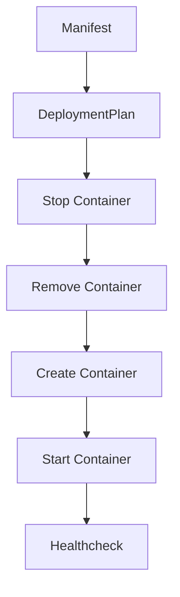
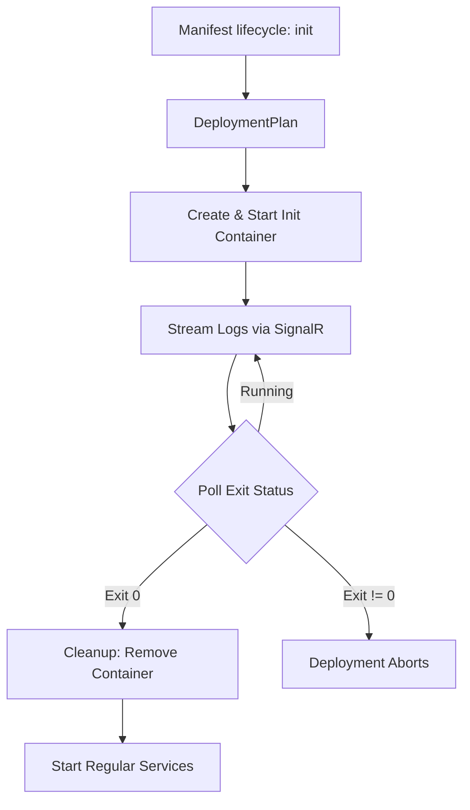

# Container Lifecycle

This document describes the lifecycle of containers under ReadyStackGo.

## Service Container Lifecycle

Regular service containers (lifecycle: service) are long-running processes.

### Steps

1. Manifest assigns version
2. DeploymentPlan generates actions
3. Container is stopped (if needed)
4. Container is removed
5. Container is recreated (with current version)
6. Container is started
7. Optional healthcheck

## Init Container Lifecycle

Init containers (lifecycle: init) are run-once containers that execute before regular services start. Typical use cases: database migrations, schema setup, seed data.

### Steps

1. Manifest defines service with `lifecycle: init`
2. DeploymentPlan separates init steps from regular steps
3. Init container is created and started
4. Logs are streamed in real-time via SignalR
5. Engine polls every 500ms until container exits (5-min timeout)
6. Exit code 0 = success, non-zero = deployment aborts
7. After all init containers complete: automatic cleanup (container removed)
8. Regular services start

### Key Differences from Service Containers

| Aspect | Service Container | Init Container |
|--------|------------------|----------------|
| Restart policy | `unless-stopped` | `no` |
| Health monitoring | Included | Excluded |
| Cleanup | Persisted | Removed after completion |
| Docker label | `rsgo.lifecycle=service` | `rsgo.lifecycle=init` |
| Progress counting | Counted as "Services" | Counted as "Init Containers" |

