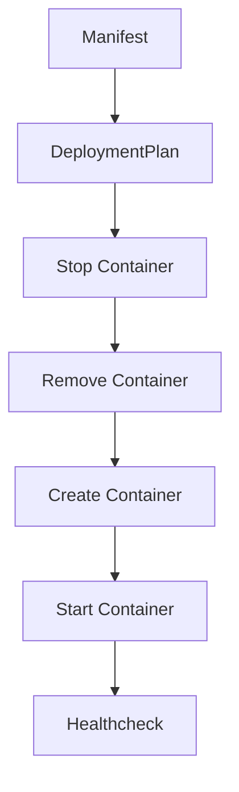

# Container Lifecycle

Dieses Dokument beschreibt den Lebenszyklus eines Kontext-Containers unter ReadyStackGo.

## Schritte

1. Manifest weist Version zu
2. DeploymentPlan erzeugt Aktionen
3. Container wird ggf. gestoppt
4. Container wird entfernt
5. Container wird neu erstellt (mit aktueller Version)
6. Container wird gestartet
7. Optionaler Healthcheck

---

