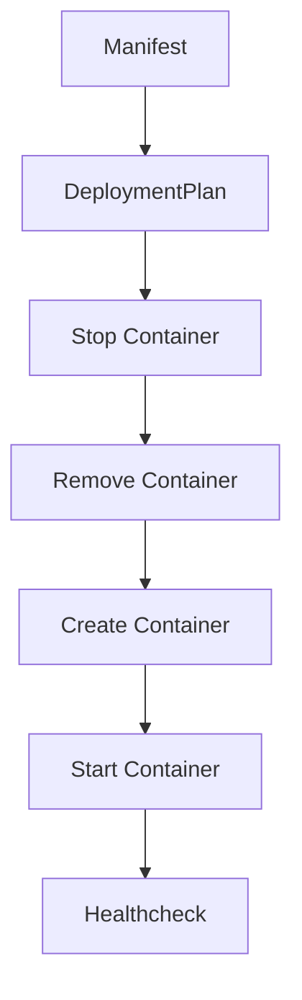

# Container Lifecycle

This document describes the lifecycle of a context container under ReadyStackGo.

## Steps

1. Manifest assigns version
2. DeploymentPlan generates actions
3. Container is stopped (if needed)
4. Container is removed
5. Container is recreated (with current version)
6. Container is started
7. Optional healthcheck

---

