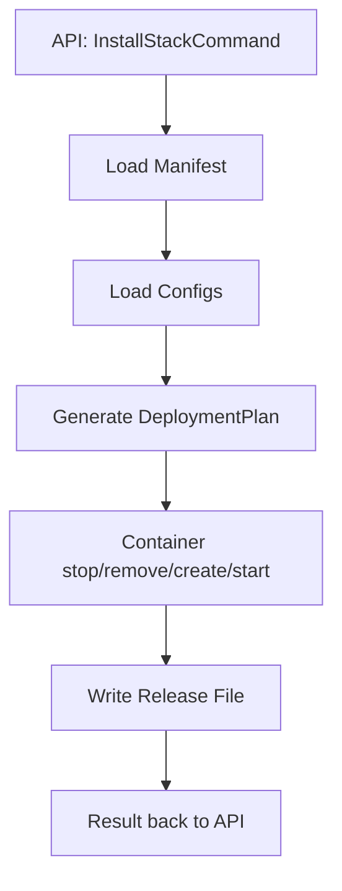

# Deployment Engine

The Deployment Engine is the heart of ReadyStackGo.
It translates manifests into concrete Docker actions.

## Contents
1. Goals
2. Input/Output
3. Flow Diagram
4. DeploymentPlan
5. Error Handling

---

## 1. Goals

- Deterministic deployments
- Clear, traceable plan
- No "hidden magic"
- Full transparency over every step

---

## 2. Input/Output

**Input**:

- ReleaseManifest
- System/Context/Feature Config

**Output**:

- DeploymentResult (Success/Failure)
- Updated `rsgo.release.json`

---

## 3. Flow Diagram

---

## 4. DeploymentPlan

The plan consists of actions:

- `stop`
- `remove`
- `create`
- `start`

For each context.

---

## 5. Error Handling

- Error → `DEPLOYMENT_FAILED`
- Details in log
- UI shows plain text + errorCode
