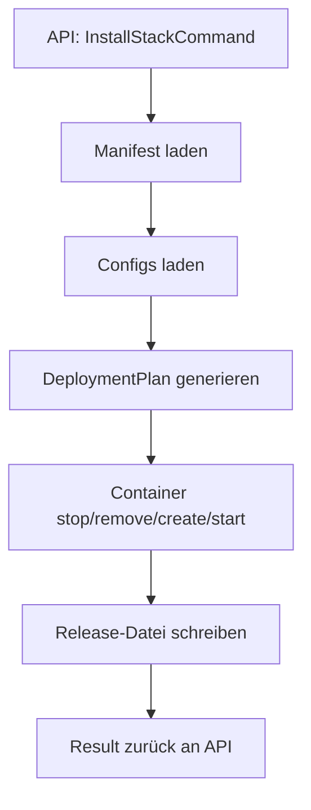

# Deployment Engine

Die Deployment Engine ist das Herzstück von ReadyStackGo.  
Sie übersetzt Manifeste in konkrete Docker-Aktionen.

## Inhalt
1. Ziele
2. Input/Output
3. Ablaufdiagramm
4. DeploymentPlan
5. Fehlerbehandlung

---

## 1. Ziele

- Deterministische Deployments
- Klarer, nachvollziehbarer Plan
- Kein „Hidden Magic“
- Volle Transparenz über jeden Schritt

---

## 2. Input/Output

**Input**:

- ReleaseManifest
- System-/Context-/Feature-Config

**Output**:

- DeploymentResult (Success/Failure)
- Aktualisierte `rsgo.release.json`

---

## 3. Ablaufdiagramm

---

## 4. DeploymentPlan

Der Plan besteht aus Aktionen:

- `stop`
- `remove`
- `create`
- `start`

Für jeden Kontext.

---

## 5. Fehlerbehandlung

- Fehler → `DEPLOYMENT_FAILED`
- Details im Log
- UI zeigt Klartext + errorCode an
