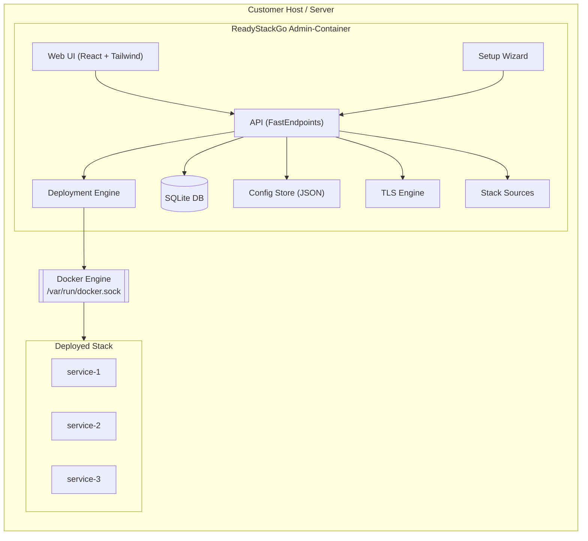
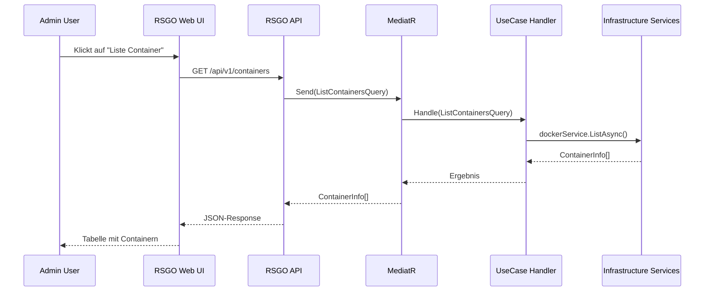
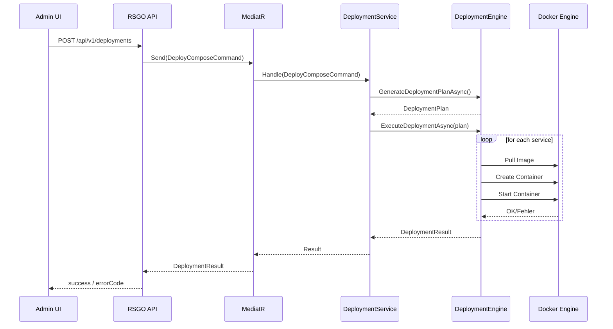
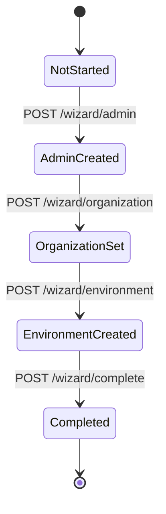
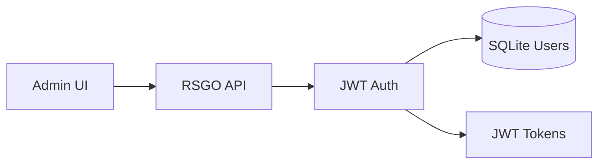

# ReadyStackGo Architecture

## Table of Contents
1. Vision & Goals
2. System Overview
3. High-Level Architecture Diagram
4. Layered Architecture
5. Request Flow
6. Deployment Engine
7. Wizard Engine
8. Security & TLS Architecture
9. Multi-Node & Future Scaling

---

## 1. Vision & Goals

ReadyStackGo ist eine selbst gehostete Plattform, die die Bereitstellung und Verwaltung komplexer Microservice-Stacks auf Basis von Docker extrem vereinfacht.
Statt direkter Arbeit mit `docker run`, Compose, Swarm oder Kubernetes erhalten Betreiber:

- einen **einzigen Admin-Container**,
- eine geführte **Wizard-Ersteinrichtung**,
- eine **Admin-Web-UI**,
- **Docker Compose-basierte Deployments** für komplette Stacks,
- klar strukturierte **Konfiguration** (SQLite + JSON).

Ziel: Einfache, wiederholbare, sichere Deployments in On-Prem- und isolierten Umgebungen.

---

## 2. System Overview

Auf hoher Ebene besteht ReadyStackGo aus:

- dem **Admin-Container** (ReadyStackGo selbst),
- dem **Docker-Host** (oder mehrere via Docker API),
- den **Stack-Containern** (Fachdomänen, BFFs, Gateways),
- einer **SQLite-Datenbank** für dynamische Daten,
- **JSON-Konfigurationsdateien** für statische Einstellungen,
- optional einem **Stack-Sources-Verzeichnis** (lokale Stacks, später Git).

---

## 3. High-Level Architecture Diagram



---

## 4. Layered Architecture

ReadyStackGo folgt einer **Clean Architecture** mit Domain-Driven Design (DDD):

```
┌────────────────────────────────────────────────────────────────┐
│                        API Layer                                │
│              (FastEndpoints, Controllers, DTOs)                 │
├────────────────────────────────────────────────────────────────┤
│                    Application Layer                            │
│         (UseCases, Commands, Queries, MediatR)                  │
├────────────────────────────────────────────────────────────────┤
│                      Domain Layer                               │
│     (Aggregates, Entities, Value Objects, Domain Services)      │
├────────────────────────────────────────────────────────────────┤
│                   Infrastructure Layer                          │
│  (EF Core, Repositories, Docker Service, External Services)     │
└────────────────────────────────────────────────────────────────┘
```

### Domain Layer (`ReadyStackGo.Domain`)

Enthält die Geschäftslogik, unabhängig von Infrastruktur:

- **SharedKernel**: AggregateRoot, Entity, ValueObject, DomainEvent
- **IdentityAccess**: Organization, User, Role (Bounded Context)
- **Deployment**: Environment, Deployment (Bounded Context)
- **StackManagement**: StackSource, StackDefinition (Bounded Context)

### Application Layer (`ReadyStackGo.Application`)

Orchestriert die Geschäftslogik über UseCases:

- **CQRS-Pattern** mit MediatR
- **UseCases**: Commands (zustandsändernd) und Queries (lesend)
- **Service Interfaces**: Abstraktion der Infrastruktur

### Infrastructure Layer (`ReadyStackGo.Infrastructure`)

Implementiert technische Belange:

- **DataAccess**: EF Core DbContext, Repositories, SQLite
- **Authentication**: JWT Token Service, BCrypt Password Hasher
- **Configuration**: JSON-basierter ConfigStore
- **Docker**: Docker Engine Integration via Docker.DotNet
- **Services**: DeploymentEngine, DeploymentService
- **Stacks**: Stack Source Provider, Cache

### API Layer (`ReadyStackGo.Api`)

HTTP-Schnittstelle:

- **FastEndpoints** für REST-APIs
- **Authentication/Authorization** Middleware
- **Request/Response** DTOs

---

## 5. Request Flow

### 5.1 High-Level Request Flow (Admin UI)



---

## 6. Deployment Engine

### 6.1 Deployment Flow



### 6.2 DeploymentPlan Struktur

Der DeploymentEngine generiert einen Plan basierend auf:

- Docker Compose YAML (geparst)
- Environment-Variablen aus Feature-Flags
- Organization-spezifische Einstellungen
- Service-Abhängigkeiten (depends_on)

```csharp
public class DeploymentPlan
{
    public string StackVersion { get; set; }
    public string? EnvironmentId { get; set; }
    public string? StackName { get; set; }
    public Dictionary<string, string> GlobalEnvVars { get; set; }
    public List<DeploymentStep> Steps { get; set; }
    public Dictionary<string, NetworkDefinition> Networks { get; set; }
}
```

---

## 7. Wizard Engine

### 7.1 Wizard State Machine



Der Wizard:

1. Erstellt den **SystemAdmin** User (erster User im System)
2. Erstellt die **Organization**
3. Erstellt das **Default Environment** (Docker Socket)
4. Markiert den Wizard als abgeschlossen

Alle Daten werden in **SQLite** persistiert, der Wizard-Status in `rsgo.system.json`.

---

## 8. Security & TLS Architecture

### 8.1 Security Overview



- **Local Auth**: Username/Passwort → BCrypt → JWT Token
- **Roles**: SystemAdmin, OrgOwner, Operator, Viewer
- **Scopes**: Global, Organization, Environment

### 8.2 TLS Flow


---

## 9. Multi-Node & Future Scaling

Auch wenn v0.6 primär Single-Node ist, ist die Architektur vorbereitet auf:

- mehrere **Docker-Hosts** (via Docker API statt Socket)
- **Environment-basierte** Trennung (Production, Staging, Dev)
- **EnvironmentType**: DockerSocket, DockerApi, (future: DockerSwarm, Kubernetes)

Das wird über das `Environment`-Aggregate gesteuert:

```csharp
public enum EnvironmentType
{
    DockerSocket = 0,  // Lokaler Docker Socket
    DockerApi = 1      // Remote Docker API
}
```

---

## Fazit

ReadyStackGo ist so aufgebaut, dass es heute einfache Single-Host-Installationen elegant löst, und morgen zu einer vollwertigen, erweiterbaren On-Prem-Orchestrierungsplattform wachsen kann.

Die **DDD-Architektur** ermöglicht:
- Klare Trennung von Geschäftslogik und Infrastruktur
- Testbare Domain-Logik
- Erweiterbare Bounded Contexts
- Einfache Migration zu anderen Datenbanken bei Bedarf
