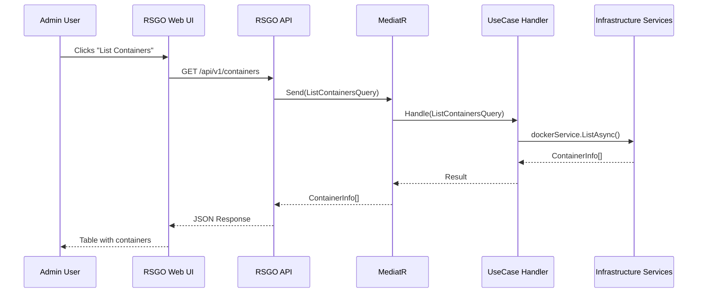
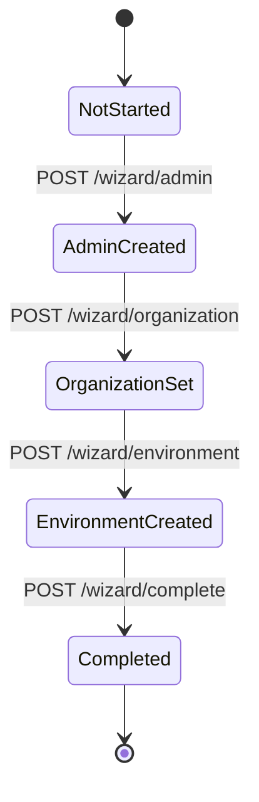
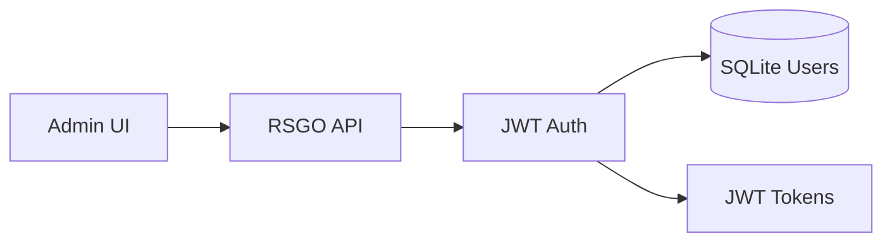
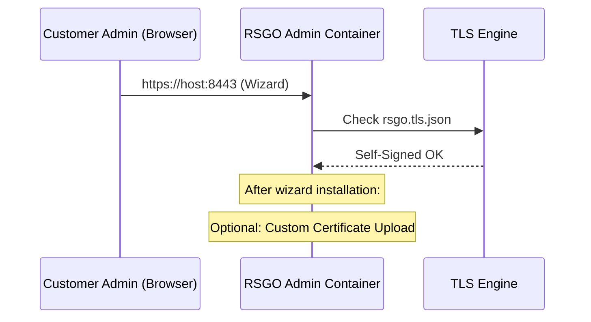

# ReadyStackGo Architecture

## Table of Contents
1. Vision & Goals
2. System Overview
3. High-Level Architecture Diagram
4. Layered Architecture
5. Request Flow
6. Deployment Engine
7. Wizard Engine
8. Security & TLS Architecture
9. Multi-Node & Future Scaling

---

## 1. Vision & Goals

ReadyStackGo is a self-hosted platform that greatly simplifies the deployment and management of complex microservice stacks based on Docker.
Instead of working directly with `docker run`, Compose, Swarm, or Kubernetes, operators get:

- a **single admin container**,
- a guided **wizard for initial setup**,
- an **admin web UI**,
- **Docker Compose-based deployments** for complete stacks,
- clearly structured **configuration** (SQLite + JSON).

Goal: Simple, repeatable, secure deployments in on-prem and isolated environments.

---

## 2. System Overview

At a high level, ReadyStackGo consists of:

- the **admin container** (ReadyStackGo itself),
- the **Docker host** (or multiple via Docker API),
- the **stack containers** (domains, BFFs, gateways),
- a **SQLite database** for dynamic data,
- **JSON configuration files** for static settings,
- optionally a **stack sources directory** (local stacks, later Git).

---

## 3. High-Level Architecture Diagram


---

## 4. Layered Architecture

ReadyStackGo follows a **Clean Architecture** with Domain-Driven Design (DDD):

```
┌────────────────────────────────────────────────────────────────┐
│                        API Layer                                │
│              (FastEndpoints, Controllers, DTOs)                 │
├────────────────────────────────────────────────────────────────┤
│                    Application Layer                            │
│         (UseCases, Commands, Queries, MediatR)                  │
├────────────────────────────────────────────────────────────────┤
│                      Domain Layer                               │
│     (Aggregates, Entities, Value Objects, Domain Services)      │
├────────────────────────────────────────────────────────────────┤
│                   Infrastructure Layer                          │
│  (EF Core, Repositories, Docker Service, External Services)     │
└────────────────────────────────────────────────────────────────┘
```

### Domain Layer (`ReadyStackGo.Domain`)

Contains business logic, independent of infrastructure:

- **SharedKernel**: AggregateRoot, Entity, ValueObject, DomainEvent
- **IdentityAccess**: Organization, User, Role (Bounded Context)
- **Deployment**: Environment, Deployment (Bounded Context)
- **StackManagement**: StackSource, StackDefinition (Bounded Context)

### Application Layer (`ReadyStackGo.Application`)

Orchestrates business logic via UseCases:

- **CQRS Pattern** with MediatR
- **UseCases**: Commands (state-changing) and Queries (read-only)
- **Service Interfaces**: Infrastructure abstraction

### Infrastructure Layer (`ReadyStackGo.Infrastructure`)

Implements technical concerns:

- **DataAccess**: EF Core DbContext, Repositories, SQLite
- **Authentication**: JWT Token Service, BCrypt Password Hasher
- **Configuration**: JSON-based ConfigStore
- **Docker**: Docker Engine Integration via Docker.DotNet
- **Services**: DeploymentEngine, DeploymentService
- **Stacks**: Stack Source Provider, Cache

### API Layer (`ReadyStackGo.Api`)

HTTP interface:

- **FastEndpoints** for REST APIs
- **Authentication/Authorization** Middleware
- **Request/Response** DTOs

---

## 5. Request Flow

### 5.1 High-Level Request Flow (Admin UI)



---

## 6. Deployment Engine

### 6.1 Deployment Flow


### 6.2 DeploymentPlan Structure

The DeploymentEngine generates a plan based on:

- Docker Compose YAML (parsed)
- Environment variables from feature flags
- Organization-specific settings
- Service dependencies (depends_on)

```csharp
public class DeploymentPlan
{
    public string StackVersion { get; set; }
    public string? EnvironmentId { get; set; }
    public string? StackName { get; set; }
    public Dictionary<string, string> GlobalEnvVars { get; set; }
    public List<DeploymentStep> Steps { get; set; }
    public Dictionary<string, NetworkDefinition> Networks { get; set; }
}
```

---

## 7. Wizard Engine

### 7.1 Wizard State Machine



The wizard:

1. Creates the **SystemAdmin** user (first user in the system)
2. Creates the **Organization**
3. Creates the **Default Environment** (Docker Socket)
4. Marks the wizard as completed

All data is persisted in **SQLite**, wizard status in `rsgo.system.json`.

---

## 8. Security & TLS Architecture

### 8.1 Security Overview



- **Local Auth**: Username/Password → BCrypt → JWT Token
- **Roles**: SystemAdmin, OrgOwner, Operator, Viewer
- **Scopes**: Global, Organization, Environment

### 8.2 TLS Flow



---

## 9. Multi-Node & Future Scaling

While v0.6 is primarily single-node, the architecture is prepared for:

- multiple **Docker hosts** (via Docker API instead of socket)
- **environment-based** separation (Production, Staging, Dev)
- **EnvironmentType**: DockerSocket, DockerApi, (future: DockerSwarm, Kubernetes)

This is controlled via the `Environment` aggregate:

```csharp
public enum EnvironmentType
{
    DockerSocket = 0,  // Local Docker Socket
    DockerApi = 1      // Remote Docker API
}
```

---

## Conclusion

ReadyStackGo is designed to elegantly solve simple single-host installations today, and grow into a full-featured, extensible on-prem orchestration platform tomorrow.

The **DDD architecture** enables:
- Clear separation of business logic and infrastructure
- Testable domain logic
- Extensible bounded contexts
- Easy migration to other databases if needed
