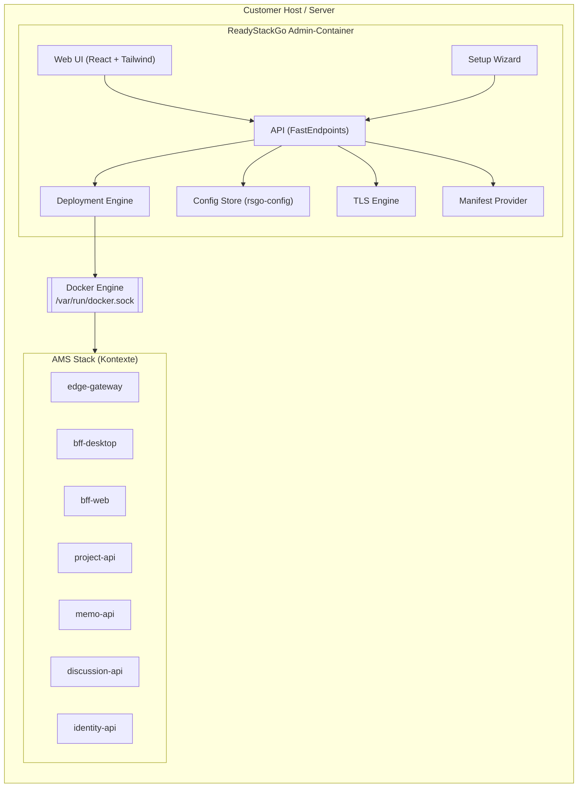
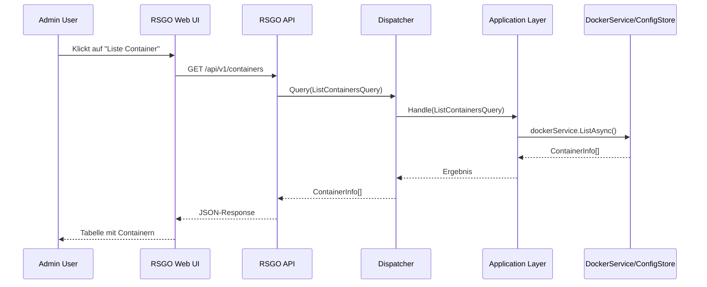
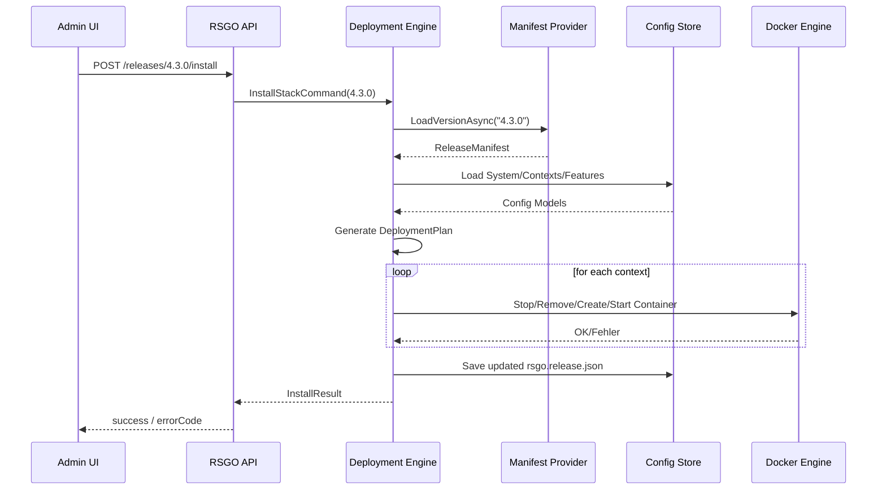
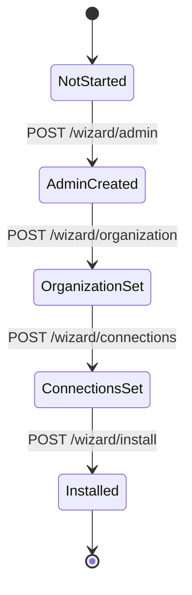
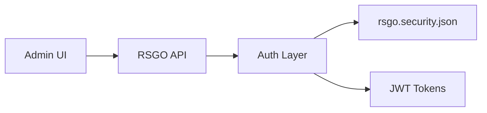
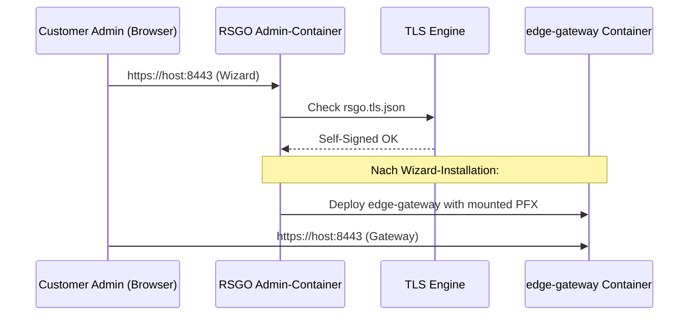

# ReadyStackGo Architecture

## Table of Contents
1. Vision & Goals
2. System Overview
3. High-Level Architecture Diagram
4. Component Breakdown
5. Request Flow
6. Deployment Engine
7. Wizard Engine
8. Security & TLS Architecture
9. Multi-Node & Future Scaling

---

## 1. Vision & Goals

ReadyStackGo ist eine selbst gehostete Plattform, die die Bereitstellung und Verwaltung komplexer Microservice-Stacks auf Basis von Docker extrem vereinfacht.  
Statt direkter Arbeit mit `docker run`, Compose, Swarm oder Kubernetes erhalten Betreiber:

- einen **einzigen Admin-Container**,
- eine geführte **Wizard-Ersteinrichtung**,
- eine **Admin-Web-UI**,
- **Manifest-basierte Deployments** für komplette Stacks,
- klar strukturierte **Config-Files** zur Anpassung.

Ziel: Einfache, wiederholbare, sichere Deployments in On-Prem- und isolierten Umgebungen.

---

## 2. System Overview

Auf hoher Ebene besteht ReadyStackGo aus:

- dem **Admin-Container** (ReadyStackGo selbst),
- dem **Docker-Host**,
- den **Kontext-Containern** (Fachdomänen, BFFs, Gateways),
- einem persistenten **Config-Volume (`rsgo-config`)**,
- optional einem **Manifeste-Speicher** (z. B. lokales Verzeichnis, Git-Repo, Artifact-Feed).

---

## 3. High-Level Architecture Diagram

---

## 4. Component Breakdown

### 4.1 Admin-Container

- **API (FastEndpoints)**  
  - stellt alle Endpunkte unter `/api/v1` bereit  
  - nutzt den Dispatcher, um Commands/Queries auszuführen  

- **Web UI (React + Tailwind + TailAdmin)**  
  - Wizard-UI  
  - Admin-Dashboard  
  - Konfigurationsseiten (TLS, Features, Contexts, Releases)  

- **Deployment Engine**  
  - erzeugt Deployment-Pläne aus Manifesten  
  - orchestriert `stop → remove → create → start` der Kontext-Container  

- **Config Store**  
  - liest/schreibt `rsgo.*.json` im Volume `rsgo-config`  
  - stark typisierte Config-Modelle  

- **TLS Engine**  
  - erzeugt Self-Signed-Zertifikate beim Bootstrap  
  - validiert & installiert Custom-PFX-Zertifikate  

- **Manifest Provider**  
  - liest Release-Manifeste (Stack-Definitionen)  
  - validiert Schema-Versionen  

---

### 4.2 Kontext-Container

- Fachdienste: `project`, `memo`, `discussion`, `identity`, …  
- BFFs: `bff-desktop`, `bff-web`  
- Gateway: `edge-gateway` (terminiert TLS nach außen)

Alle werden über das gemeinsame Docker-Netzwerk `rsgo-net` verbunden und erhalten:

- `RSGO_*`-EnvVars (Features, Verbindungen, Organisation, Stack-Version)
- optional zusätzliche EnvVars aus dem Manifest

---

## 5. Request Flow

### 5.1 High-Level Request Flow (Admin UI)

---

## 6. Deployment Engine

### 6.1 Deployment Flow

---

## 7. Wizard Engine

### 7.1 Wizard State Machine

Jeder Übergang:

- validiert die Eingaben  
- schreibt eine oder mehrere `rsgo.*.json` Dateien  
- aktualisiert `wizardState` in `rsgo.system.json`

---

## 8. Security & TLS Architecture

### 8.1 Security Overview

- Local Auth (Default): Username/Passwort → JWT  
- Später OIDC: Weiterleitung zum externen Identity Provider  

### 8.2 TLS Flow

---

## 9. Multi-Node & Future Scaling

Auch wenn v1 primär Single-Node ist, ist die Architektur vorbereitet auf:

- mehrere Docker-Hosts (Nodes)  
- Rollen pro Node (`gateway`, `compute`, `storage`)  
- Node-Zuordnung pro Kontext im Manifest  

Das wird über `rsgo.nodes.json` und einen abstrahierten `IDockerService` pro Node umgesetzt.

---

Fazit:  
ReadyStackGo ist so aufgebaut, dass es heute einfache Single-Host-Installationen elegant löst, und morgen zu einer vollwertigen, erweiterbaren On-Prem-Orchestrierungsplattform wachsen kann.
