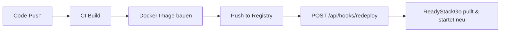
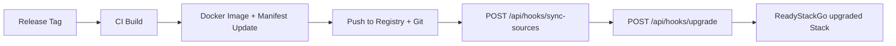

# CI/CD Integration

ReadyStackGo lässt sich vollständig in automatisierte Build- und Release-Prozesse integrieren. Über **API Keys** und **Webhook-Endpoints** können CI/CD Pipelines Deployments auslösen, Upgrades durchführen und den Stack-Katalog synchronisieren.

## Use Cases

- **Dev/Test**: Nach jedem erfolgreichen Build automatisch den Stack redeployen (frische Images)
- **Formale Releases**: Katalog synchronisieren und auf eine neue Version upgraden
- **Katalog-Sync**: Nach Änderungen am Manifest im Git-Repository den Katalog aktualisieren

## Authentication

Pipeline-Zugriff erfolgt über **API Keys** statt JWT Tokens:

1. API Key erstellen unter **Settings → CI/CD Integration**
2. Key als `X-Api-Key` HTTP Header übergeben
3. Keys können optional auf ein Environment beschränkt werden
4. Fine-grained Permissions pro Key (Redeploy, Upgrade, Sync Sources)

### API Key erstellen

1. Navigiere zu **Settings → CI/CD Integration**
2. Klicke **Create API Key**
3. Vergib einen beschreibenden Namen (z.B. "GitHub Actions Deploy")
4. Wähle die benötigten Permissions:
   - **Redeploy** – Stack mit frischen Images neu starten
   - **Upgrade** – Stack auf neue Katalog-Version upgraden
   - **Sync Sources** – Katalog-Quellen synchronisieren
5. Optional: Ablaufdatum setzen
6. **Kopiere den Key sofort** – er wird nur einmal angezeigt!

### Environment-Scope

Wird ein API Key mit einem Environment verknüpft, muss die `environmentId` nicht in jedem Request mitgesendet werden – sie wird automatisch aus dem API Key Claim `env_id` ermittelt.

## Webhook-Endpoints

Alle Endpoints befinden sich unter `/api/hooks/` und erfordern API Key Authentifizierung.

### POST /api/hooks/redeploy

Triggert ein Redeployment eines laufenden Stacks. Stoppt die bestehenden Container, pullt frische Images und startet neu – mit denselben Variablen und Einstellungen.

**Request:**
```json
{
  "stackName": "ams-project",
  "environmentId": "optional-wenn-key-environment-gebunden"
}
```

**Response (200):**
```json
{
  "success": true,
  "message": "Successfully triggered redeploy of 'ams-project'.",
  "deploymentId": "d4f8b2...",
  "stackName": "ams-project",
  "stackVersion": "6.4.0"
}
```

**Permission:** `Hooks.Redeploy`

### POST /api/hooks/upgrade

Triggert ein Upgrade auf eine bestimmte Katalog-Version. Führt die Version-Validierung durch (kein Downgrade), merged Variablen und delegiert an den bestehenden Upgrade-Flow.

**Request:**
```json
{
  "stackName": "ams-project",
  "targetVersion": "6.5.0",
  "environmentId": "optional",
  "variables": {
    "NEW_SETTING": "value"
  }
}
```

**Response (200):**
```json
{
  "success": true,
  "message": "Successfully upgraded 'ams-project' from 6.4.0 to 6.5.0.",
  "deploymentId": "d4f8b2...",
  "previousVersion": "6.4.0",
  "newVersion": "6.5.0"
}
```

**Permission:** `Hooks.Upgrade`

### POST /api/hooks/sync-sources

Synchronisiert alle Stack-Katalog-Quellen (lokale Verzeichnisse und Git Repositories). Nützlich nach einem Git Push mit aktualisierten Manifests.

**Request:** Leerer Body oder `{}`

**Response (200):**
```json
{
  "success": true,
  "stacksLoaded": 12,
  "sourcesSynced": 3,
  "message": "Synced 3 source(s), loaded 12 stack(s)."
}
```

**Permission:** `Hooks.SyncSources`

## Typische Pipeline-Flows

### Dev/Test: Redeploy nach Build



### Formales Release: Sync + Upgrade



## Fehlerbehandlung

| HTTP Status | Bedeutung |
|-------------|-----------|
| 200 | Erfolg |
| 400 | Ungültige Anfrage (Stack nicht gefunden, ungültige Version, etc.) |
| 401 | Nicht authentifiziert (fehlender oder ungültiger API Key) |
| 403 | Nicht autorisiert (API Key hat nicht die benötigte Permission) |
| 500 | Server-Fehler bei der Katalog-Synchronisation |

## Sicherheit

- API Keys werden als SHA-256 Hash in der Datenbank gespeichert
- Keys haben das Format `rsgo_` + 32 alphanumerische Zeichen (~190 Bit Entropie)
- Keys können jederzeit widerrufen werden (Settings → CI/CD → Revoke)
- Webhook-Endpoints sind nur über API Keys erreichbar, nicht über JWT
- Optional: Environment-Scope beschränkt den Key auf ein bestimmtes Environment
