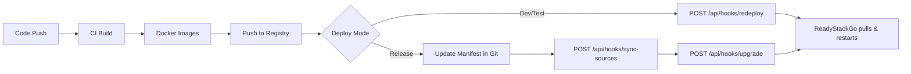

# CI/CD Integration

ReadyStackGo is designed to be integrated into a fully automated build and release process.

> **Implementation Specification**: See [PLAN-cicd-integration](../Plans/PLAN-cicd-integration.md) for the detailed implementation plan (v0.19).

## Use Cases

- Automatic build of context containers
- Automatic tagging (`x.y.z`, `-alpha`, `-beta`)
- Manifest generation
- Triggering deployments on a dev/QA server via **Webhook API**
- **Redeploy**: Pull fresh images and restart existing stack (dev/test)
- **Upgrade**: Upgrade to a new catalog version (formal releases)
- **Catalog Sync**: Trigger re-sync of stack sources after manifest changes

## Authentication

Pipeline access uses **API Keys** instead of JWT tokens:
- Create API keys in Settings → CI/CD
- Pass via `X-Api-Key` HTTP header
- Keys can be scoped to specific environments
- Fine-grained permissions per key

## Webhook Endpoints

| Endpoint | Method | Description |
|----------|--------|-------------|
| `/api/hooks/redeploy` | POST | Redeploy existing stack (fresh image pull) |
| `/api/hooks/upgrade` | POST | Upgrade to specific catalog version |
| `/api/hooks/sync-sources` | POST | Trigger catalog source re-sync |

---

