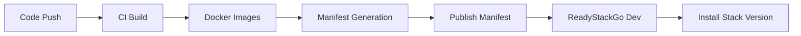

# CI/CD Integration

ReadyStackGo is designed to be integrated into a fully automated build and release process.

## Use Cases

- Automatic build of context containers
- Automatic tagging (`x.y.z`, `-alpha`, `-beta`)
- Manifest generation
- Triggering deployments on a dev/QA server

---

