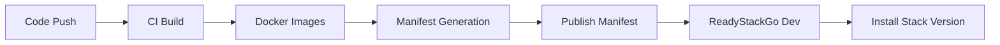

# CI/CD Integration

ReadyStackGo ist darauf ausgelegt, in einen vollautomatisierten Build- und Release-Prozess eingebunden zu werden.

## Use Cases

- Automatischer Build von Kontext-Containern
- Automatisches Tagging (`x.y.z`, `-alpha`, `-beta`)
- Erzeugung von Manifesten
- Triggern von Deployments auf einem Dev-/QA-Server

---

