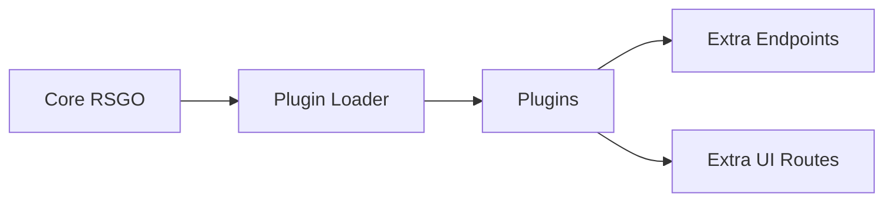

# Plugin System

Planned plugin system for extending ReadyStackGo.

## Goals

- New menu items and pages in the UI
- Additional APIs
- Deployment hooks
- Metrics/Monitoring integrations

---

```mermaid
flowchart LR
    A[Core RSGO] --> B[Plugin Loader]
    B --> C[Plugins]
    C --> D[Extra Endpoints]
    C --> E[Extra UI Routes]
```
