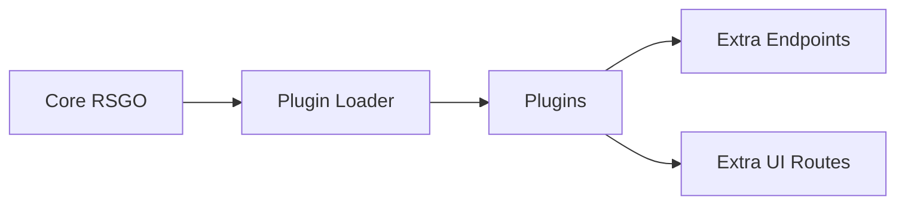

# Plugin System

Geplantes Plugin-System zur Erweiterung von ReadyStackGo.

## Ziele

- Neue Menüpunkte und Seiten in der UI
- Zusätzliche APIs
- Deployment-Hooks
- Metriken/Monitoring-Integrationen

---

