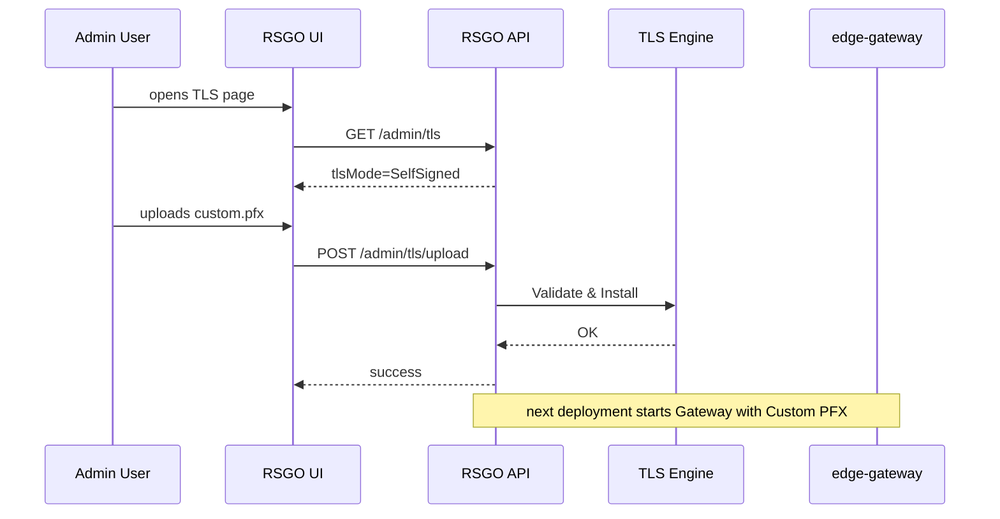

# TLS System Documentation

This document describes the TLS/certificate system of ReadyStackGo.

## Contents
1. Goals
2. TLS Modes
3. Bootstrap with Self-Signed
4. Custom Certificates
5. Integration in Gateway
6. Diagrams

---

## 1. Goals

- Immediate security with self-signed certificates
- Later replacement with custom certificates possible
- TLS termination in the gateway
- Minimal complexity for the operator

---

## 2. TLS Modes

- `SelfSigned` – Default on first start
- `Custom` – PFX upload by admin

Defined in `rsgo.tls.json`.

---

## 3. Bootstrap with Self-Signed

On first start:

1. Check if `rsgo.tls.json` exists
2. If not → Generate self-signed certificate
3. Store PFX at `/app/certs/selfsigned.pfx`
4. Write `rsgo.tls.json` with `mode = SelfSigned`

---

## 4. Custom Certificates

Via Admin UI:

- Upload a PFX file
- Enter password
- Validation (expiration date, private key, etc.)
- Update `rsgo.tls.json` with `mode = Custom`

---

## 5. TLS Flow Diagram

