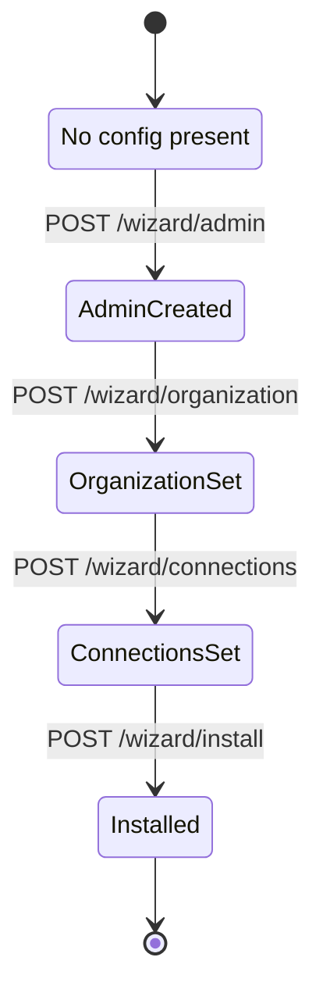

# Wizard – Setup Flow Documentation

Der ReadyStackGo-Wizard ist dafür zuständig, neue Installationen so einfach wie möglich zu machen.

## Inhalt
1. Ziele
2. States & State Machine
3. API-Endpunkte
4. UI-Flow
5. Validierungen

---

## 1. Ziele

- Minimal notwendige Fragen stellen
- Sichere Defaults wählen
- Nutzer nicht mit Details überfordern
- Fortgeschrittene Optionen später in der Admin-UI

---

## 2. State Machine

---

## 3. API-Endpunkte

- `GET /api/v1/wizard/status`
- `POST /api/v1/wizard/admin`
- `POST /api/v1/wizard/organization`
- `POST /api/v1/wizard/connections`
- `POST /api/v1/wizard/install`

Details sind in der technischen Spezifikation beschrieben.

---

## 4. UI-Flow

1. **Admin** – Lokalen Administrator festlegen  
2. **Organisation** – Technische ID + Anzeigename  
3. **Verbindungen** – Simple Mode (Transport, Persistence, EventStore)  
4. **Installation** – Zusammenfassung & Installation des ausgewählten Manifests  

---

## 5. Validierungen

- Admin: Benutzername/Passwort nicht leer, Mindestlänge
- Organisation: ID ohne Sonderzeichen, Name nicht leer
- Verbindungen: Strings nicht leer, einfache Syntaxprüfung
