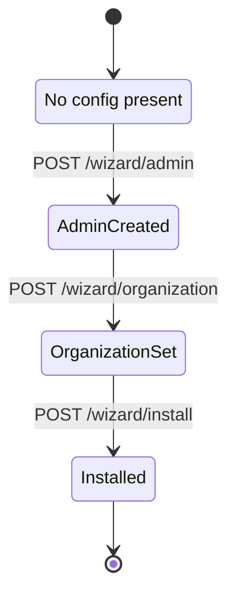
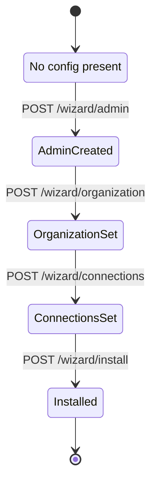

# Wizard – Setup Flow Documentation

The ReadyStackGo wizard is responsible for making new installations as easy as possible.

## Contents
1. Goals
2. States & State Machine
3. API Endpoints
4. UI Flow
5. Validations
6. Version History

---

## 1. Goals

- Ask only minimally necessary questions
- Choose secure defaults
- Don't overwhelm users with details
- Advanced options later in the admin UI
- Fast onboarding without complex configurations

---

## 2. State Machine

### Current (v0.4+)

**Important Changes:**
- `ConnectionsSet` state was removed
- Direct transition from `OrganizationSet` to `Installed`
- No more global connection strings

### Legacy (v0.3)

---

## 3. API Endpoints

### Current Endpoints (v0.4+)

- `GET /api/v1/wizard/status` - Get current wizard status
- `POST /api/v1/wizard/admin` - Create admin account
- `POST /api/v1/wizard/organization` - Set organization
- `POST /api/v1/wizard/install` - Complete wizard

### Removed Endpoints (v0.3)

- ~~`POST /api/v1/wizard/connections`~~ - Removed in v0.4

**Rationale:** Connection strings are now stack-specific and configured during stack deployment, no longer globally in the wizard.

Details are described in the [Technical Specification](../Reference/Technical-Specification.md).

---

## 4. UI Flow

### v0.4+ (3 Steps - Simplified)

1. **Step 1: Admin Account** – Set up local administrator
   - Username (freely selectable)
   - Password (BCrypt hashing)

2. **Step 2: Organization** – Configure organization
   - Technical ID (e.g., "acme-corp")
   - Display name (e.g., "Acme Corporation")

3. **Step 3: Complete** – Complete wizard
   - Summary of configuration
   - Confirm installation
   - Redirect to dashboard

**After the Wizard:**
- User can create environments via Settings → Environments
- Stacks can be deployed (Docker Compose format)
- Configuration values are specified per stack deployment

### v0.3 (4 Steps - Legacy)

1. **Admin Account** – Set up local administrator
2. **Organization** – Technical ID + display name
3. **Connections** – Simple Mode (Transport, Persistence, EventStore) ← **REMOVED in v0.4**
4. **Installation** – Summary & installation

---

## 5. Validations

### Admin Account (Step 1)
- Username not empty
- Username minimum length: 3 characters
- Password not empty
- Password minimum length: 8 characters
- BCrypt hashing on save

### Organization (Step 2)
- Organization ID not empty
- Organization ID: Only lowercase letters, numbers, hyphens
- Organization ID: Pattern `^[a-z0-9-]+$`
- Organization name not empty
- Organization name minimum length: 2 characters

### Installation (Step 3)
- Admin account was created
- Organization was set
- System writes `rsgo.system.json` with empty `environments` array

---

## 6. Version History

### v0.4.0 (Current)
- Simplified Wizard: 4 Steps → 3 Steps
- Removed "Configure Connections" step
- Organizations can exist without environments
- No default environment auto-creation
- Stack-specific configuration (per deployment)

### v0.3.0
- 4-Step Wizard
- Global connection strings in `rsgo.contexts.json`
- Mandatory connection configuration during setup

### v0.2.0
- Basic wizard implementation
- Hardcoded admin credentials

---

## Migration Notes

### v0.3 → v0.4

**Automatic Migration:**
- `WizardState.ConnectionsSet` is automatically migrated to `Installed`
- `rsgo.contexts.json` is archived (`.v0.3.backup`)
- No manual intervention required

**After Migration:**
- Organization exists without environments
- User must create environments via Settings
- Connection strings are configured per stack deployment
