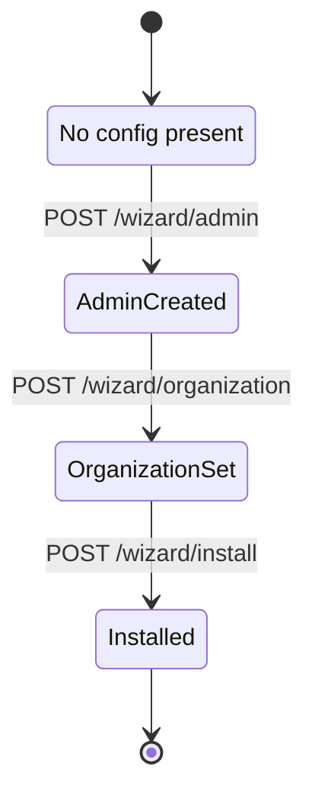
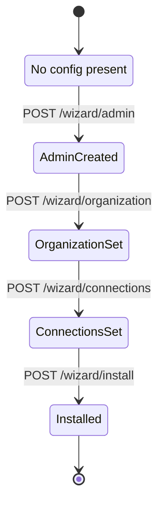

# Wizard – Setup Flow Documentation

Der ReadyStackGo-Wizard ist dafür zuständig, neue Installationen so einfach wie möglich zu machen.

## Inhalt
1. Ziele
2. States & State Machine
3. API-Endpunkte
4. UI-Flow
5. Validierungen
6. Version History

---

## 1. Ziele

- Minimal notwendige Fragen stellen
- Sichere Defaults wählen
- Nutzer nicht mit Details überfordern
- Fortgeschrittene Optionen später in der Admin-UI
- Schnelles Onboarding ohne komplexe Konfigurationen

---

## 2. State Machine

### Current (v0.4+)

**Wichtige Änderungen:**
- ❌ `ConnectionsSet` State wurde entfernt
- ✅ Direkt von `OrganizationSet` zu `Installed`
- ✅ Keine globalen Connection Strings mehr

### Legacy (v0.3)

---

## 3. API-Endpunkte

### Aktuelle Endpunkte (v0.4+)

- `GET /api/v1/wizard/status` - Aktuellen Wizard-Status abrufen
- `POST /api/v1/wizard/admin` - Admin-Account erstellen
- `POST /api/v1/wizard/organization` - Organisation festlegen
- `POST /api/v1/wizard/install` - Wizard abschließen

### Entfernte Endpunkte (v0.3)

- ~~`POST /api/v1/wizard/connections`~~ - Wurde in v0.4 entfernt

**Rationale:** Connection Strings sind jetzt stack-spezifisch und werden bei der Stack-Deployment konfiguriert, nicht mehr global im Wizard.

Details sind in der [Technical Specification](../Reference/Technical-Specification.md) beschrieben.

---

## 4. UI-Flow

### v0.4+ (3 Steps - Simplified)

1. **Step 1: Admin Account** – Lokalen Administrator festlegen
   - Benutzername (frei wählbar)
   - Passwort (BCrypt-Hashing)

2. **Step 2: Organization** – Organisation konfigurieren
   - Technische ID (z.B. "acme-corp")
   - Anzeigename (z.B. "Acme Corporation")

3. **Step 3: Complete** – Wizard abschließen
   - Zusammenfassung der Konfiguration
   - Installation bestätigen
   - Redirect zum Dashboard

**Nach dem Wizard:**
- Benutzer kann Environments über Settings → Environments erstellen
- Stacks können deployed werden (Docker Compose Format)
- Konfigurationswerte werden pro Stack-Deployment angegeben

### v0.3 (4 Steps - Legacy)

1. **Admin Account** – Lokalen Administrator festlegen
2. **Organisation** – Technische ID + Anzeigename
3. **Verbindungen** – Simple Mode (Transport, Persistence, EventStore) ← **ENTFERNT in v0.4**
4. **Installation** – Zusammenfassung & Installation

---

## 5. Validierungen

### Admin Account (Step 1)
- ✅ Benutzername nicht leer
- ✅ Benutzername Mindestlänge: 3 Zeichen
- ✅ Passwort nicht leer
- ✅ Passwort Mindestlänge: 8 Zeichen
- ✅ BCrypt-Hashing beim Speichern

### Organisation (Step 2)
- ✅ Organisation ID nicht leer
- ✅ Organisation ID: Nur Kleinbuchstaben, Zahlen, Bindestriche
- ✅ Organisation ID: Pattern `^[a-z0-9-]+$`
- ✅ Organisation Name nicht leer
- ✅ Organisation Name Mindestlänge: 2 Zeichen

### Installation (Step 3)
- ✅ Admin Account wurde erstellt
- ✅ Organisation wurde festgelegt
- ✅ System schreibt `rsgo.system.json` mit leerem `environments` Array

---

## 6. Version History

### v0.4.0 (Current)
- ✅ Simplified Wizard: 4 Steps → 3 Steps
- ✅ Removed "Configure Connections" step
- ✅ Organizations can exist without environments
- ✅ No default environment auto-creation
- ✅ Stack-specific configuration (per deployment)

### v0.3.0
- ✅ 4-Step Wizard
- ✅ Global connection strings in `rsgo.contexts.json`
- ✅ Mandatory connection configuration during setup

### v0.2.0
- ✅ Basic wizard implementation
- ✅ Hardcoded admin credentials

---

## Migration Notes

### v0.3 → v0.4

**Automatische Migration:**
- `WizardState.ConnectionsSet` wird automatisch zu `Installed` migriert
- `rsgo.contexts.json` wird archiviert (`.v0.3.backup`)
- Keine manuellen Eingriffe erforderlich

**Nach Migration:**
- Organisation existiert ohne Environments
- Benutzer muss Environments über Settings erstellen
- Connection Strings werden pro Stack-Deployment konfiguriert
